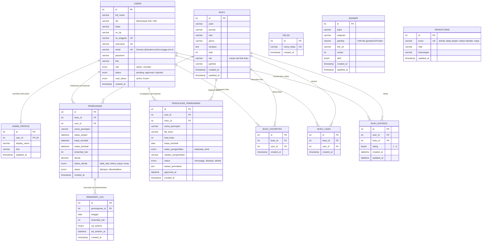

# Entity Relationship Diagram (ERD) & Spesifikasi Basis Data
## Sistem Informasi Perpustakaan Digital — AKSA NOVA

> **Versi:** 2.0 | **Terakhir Diperbarui:** 14 September 2026 | **Database:** MySQL 8.0 / InnoDB / `utf8mb4`

Dokumen ini memuat arsitektur basis data relasional sistem **AKSA NOVA** (MySQL 8.0 / InnoDB / `utf8mb4`), mencakup diagram hubungan entitas, kardinalitas, kamus data lengkap (data dictionary), serta aturan integritas data.

---

## 1. Visualisasi Diagram Hubungan Entitas (ERD)



---

## 2. Kamus Data Lengkap (Data Dictionary)

### 2.1 Tabel `users`
Menyimpan data akun pengguna baik administrator perpustakaan maupun anggota (siswa/guru SMKN 1 Rongga).

| Kolom | Tipe Data | Nullable | Default | Keterangan & Aturan |
|---|---|---|---|---|
| `id` | `INT` | No | AUTO_INCREMENT | **Primary Key** identitas unik pengguna. |
| `full_name` | `VARCHAR(100)` | No | - | Nama lengkap resmi pengguna. |
| `nik` | `VARCHAR(30)` | No | `''` | **Nomor Induk Siswa (NIS)** / NIK siswa. Ditampilkan sebagai NIS pada profil & kartu anggota. |
| `kelas` | `VARCHAR(50)` | No | `''` | Tingkat kelas anggota (misal: "X RPL 1", "XI TKJ 1"). |
| `no_hp` | `VARCHAR(20)` | No | `''` | Nomor WhatsApp aktif untuk notifikasi & pengingat keterlambatan. |
| `no_anggota` | `VARCHAR(30)` | No | `''` | **Unique Key**. Nomor unik kartu anggota (cth: `AN-202609-0012`). |
| `username` | `VARCHAR(50)` | No | - | **Unique Key**. Nama pengguna untuk autentikasi. |
| `email` | `VARCHAR(100)` | No | - | **Unique Key**. Alamat surel terdaftar (validasi domain `@student.smkn1rongga.sch.id`). |
| `password` | `VARCHAR(255)` | No | - | Hash sandi menggunakan algoritma BCRYPT (`password_hash`). |
| `foto` | `VARCHAR(255)` | No | `''` | Path file foto profil (disimpan di `uploads/foto_profil/`). |
| `role` | `ENUM('admin','member')` | Yes | `'member'` | Peran pengguna dalam sistem. |
| `status` | `ENUM('pending','approved','rejected')` | No | `'pending'` | Status persetujuan keanggotaan oleh pustakawan. |
| `card_status` | `ENUM('active','frozen')` | No | `'active'` | Status kartu; dibekukan sementara saat alur Lupa Kartu berlangsung. |
| `created_at` | `TIMESTAMP` | Yes | `CURRENT_TIMESTAMP` | Waktu registrasi awal dibuat. |

---

### 2.2 Tabel `admin_profile`
Menyimpan preferensi visual dan profil display khusus untuk akun admin.

| Kolom | Tipe Data | Nullable | Default | Keterangan & Aturan |
|---|---|---|---|---|
| `id` | `INT` | No | AUTO_INCREMENT | **Primary Key**. |
| `user_id` | `INT` | No | - | **Foreign Key** ke `users.id` (1:1). `ON DELETE CASCADE ON UPDATE CASCADE`. |
| `display_name` | `VARCHAR(100)` | No | `'Admin'` | Nama panggilan admin yang tampil di sidebar & dashboard. |
| `foto` | `VARCHAR(255)` | No | `''` | Path foto avatar admin tersendiri. |
| `updated_at` | `TIMESTAMP` | Yes | `CURRENT_TIMESTAMP ON UPDATE` | Waktu pembaruan profil terakhir. |

---

### 2.3 Tabel `kelas`
Master referensi tingkatan kelas siswa untuk mempermudah pendaftaran anggota.

| Kolom | Tipe Data | Nullable | Default | Keterangan & Aturan |
|---|---|---|---|---|
| `id` | `INT` | No | AUTO_INCREMENT | **Primary Key**. |
| `nama_kelas` | `VARCHAR(50)` | No | - | **Unique Key**. Nama kelas (misal: "X RPL 1", "XI TKJ 2", "Guru"). |
| `created_at` | `TIMESTAMP` | Yes | `CURRENT_TIMESTAMP` | Waktu penambahan kelas. |

---

### 2.4 Tabel `buku`
Menyimpan seluruh katalog buku fisik perpustakaan beserta metadata lokasi penempatan fisik.

| Kolom | Tipe Data | Nullable | Default | Keterangan & Aturan |
|---|---|---|---|---|
| `id` | `INT` | No | AUTO_INCREMENT | **Primary Key** buku. |
| `judul` | `VARCHAR(255)` | No | - | Judul lengkap buku. |
| `penulis` | `VARCHAR(255)` | No | `''` | Nama pengarang/penulis buku. |
| `isbn` | `VARCHAR(50)` | No | `''` | Kode ISBN (International Standard Book Number). |
| `genre` | `VARCHAR(100)` | No | `''` | Kategori genre (misal: "Fiksi", "Teknologi", "Sains"). |
| `sinopsis` | `TEXT` | Yes | `NULL` | Ringkasan isi atau deskripsi buku. |
| `stok` | `INT` | No | `0` | Jumlah eksemplar fisik yang tersedia. |
| `rak` | `VARCHAR(100)` | No | `''` | **Lokasi Rak Buku** (cth: "Rak A-1 (Fiksi)", "Rak B-2 (Komputer)", "Rak Referensi"). Tampil pada modal detail buku di semua sisi antarmuka. |
| `gambar` | `VARCHAR(500)` | No | `''` | Path gambar cover buku (`uploads/gambar/`). |
| `created_at` | `TIMESTAMP` | Yes | `CURRENT_TIMESTAMP` | Waktu buku ditambahkan. |
| `updated_at` | `TIMESTAMP` | Yes | `CURRENT_TIMESTAMP ON UPDATE` | Waktu perubahan data buku terakhir. |

---

### 2.5 Tabel `peminjaman`
Mencatat transaksi riil peminjaman buku yang sedang berlangsung atau sudah dikembalikan.

| Kolom | Tipe Data | Nullable | Default | Keterangan & Aturan |
|---|---|---|---|---|
| `id` | `INT` | No | AUTO_INCREMENT | **Primary Key** transaksi peminjaman. |
| `buku_id` | `INT` | No | - | **Foreign Key** ke `buku.id`. `ON DELETE RESTRICT ON UPDATE CASCADE`. |
| `user_id` | `INT` | Yes | `NULL` | **Foreign Key** ke `users.id`. `ON DELETE SET NULL ON UPDATE CASCADE`. |
| `nama_peminjam`| `VARCHAR(150)` | No | - | Nama peminjam pada saat transaksi dibuat (snapshot). |
| `waktu_pinjam` | `DATETIME` | No | `CURRENT_TIMESTAMP` | Waktu buku mulai dipinjam. |
| `batas_kembali`| `DATETIME` | No | - | Tenggat waktu maksimal buku harus dikembalikan. |
| `waktu_kembali`| `DATETIME` | Yes | `NULL` | Waktu buku fisik diserahkan kembali ke pustakawan. |
| `terlambat_hari`| `INT` | No | `0` | Jumlah hari terlambat dihitung dari selisih batas kembali. |
| `denda` | `DECIMAL(12,0)`| No | `0` | Nominal total denda dalam Rupiah. |
| `status_denda` | `ENUM('tidak_ada','belum_bayar','lunas')` | No | `'tidak_ada'` | Status pelunasan kewajiban denda keterlambatan. |
| `status` | `ENUM('dipinjam','dikembalikan')` | No | `'dipinjam'` | Status fisik sirkulasi buku saat ini. |
| `created_at` | `TIMESTAMP` | No | `CURRENT_TIMESTAMP` | Waktu pembuatan baris data. |

---

### 2.6 Tabel `pengajuan_peminjaman`
Menangani alur pengajuan peminjaman buku online dari siswa sebelum disetujui pustakawan.

| Kolom | Tipe Data | Nullable | Default | Keterangan & Aturan |
|---|---|---|---|---|
| `id` | `INT` | No | AUTO_INCREMENT | **Primary Key** tiket pengajuan. |
| `user_id` | `INT` | No | - | ID anggota yang mengajukan. |
| `buku_id` | `INT` | No | - | ID buku yang hendak dipinjam. |
| `nama_peminjam`| `VARCHAR(150)` | No | - | Nama peminjam yang tertera di form. |
| `file_kartu` | `VARCHAR(255)` | No | - | Path berkas bukti kartu yang diunggah (`uploads/kartu_pengajuan/`). |
| `total_buku` | `INT` | No | `1` | Jumlah eksemplar yang diajukan. |
| `batas_kembali`| `DATE` | No | - | Tanggal pengembalian yang direncanakan. |
| `waktu_pengambilan` | `ENUM('sekarang','nanti')` | No | `'sekarang'` | Opsi pengambilan: langsung saat itu juga atau nanti di jam tertentu. |
| `catatan_pengambilan` | `VARCHAR(255)` | Yes | `NULL` | Catatan waktu spesifik jika memilih "ambil nanti". |
| `status` | `ENUM('menunggu','disetujui','ditolak')` | No | `'menunggu'` | Status tiket: memicu notifikasi pop-up besar jika `menunggu`. |
| `alasan_penolakan` | `TEXT` | Yes | `NULL` | Pesan pustakawan jika permohonan pinjam ditolak. |
| `approved_at` | `DATETIME` | Yes | `NULL` | Waktu persetujuan atau penolakan dilakukan. |
| `created_at` | `TIMESTAMP` | Yes | `CURRENT_TIMESTAMP` | Waktu pengajuan dikirim oleh anggota. |

---

### 2.7 Tabel Interaksi: `buku_favorites`, `buku_likes`, `buku_ratings`

#### Tabel `buku_favorites`
| Kolom | Tipe Data | Nullable | Default | Aturan Integritas |
|---|---|---|---|---|
| `id` | `INT` | No | AUTO_INCREMENT | **Primary Key**. |
| `buku_id` | `INT` | No | - | **FK** `buku.id` (`ON DELETE CASCADE`). |
| `user_id` | `INT` | No | - | **FK** `users.id` (`ON DELETE CASCADE`). |
| `created_at` | `TIMESTAMP` | Yes | `CURRENT_TIMESTAMP` | Waktu disimpan. |
| *Index* | `UNIQUE KEY (buku_id, user_id)` | - | - | Mencegah duplikasi buku simpanan oleh user yang sama. |

#### Tabel `buku_likes`
| Kolom | Tipe Data | Nullable | Default | Aturan Integritas |
|---|---|---|---|---|
| `id` | `INT` | No | AUTO_INCREMENT | **Primary Key**. |
| `buku_id` | `INT` | No | - | **FK** `buku.id` (`ON DELETE CASCADE`). |
| `user_id` | `INT` | No | - | **FK** `users.id` (`ON DELETE CASCADE`). |
| `created_at` | `TIMESTAMP` | Yes | `CURRENT_TIMESTAMP` | Waktu disukai. |
| *Index* | `UNIQUE KEY (buku_id, user_id)` | - | - | 1 user hanya dapat memberikan 1 like per buku. |

#### Tabel `buku_ratings`
| Kolom | Tipe Data | Nullable | Default | Aturan Integritas |
|---|---|---|---|---|
| `id` | `INT` | No | AUTO_INCREMENT | **Primary Key**. |
| `user_id` | `INT` | No | - | **FK** `users.id` (`ON DELETE CASCADE`). |
| `buku_id` | `INT` | No | - | **FK** `buku.id` (`ON DELETE CASCADE`). |
| `rating` | `TINYINT` | No | - | Nilai rating 1 sampai 5. |
| `created_at` | `DATETIME` | Yes | `CURRENT_TIMESTAMP` | Waktu ulasan pertama dibuat. |
| `updated_at` | `DATETIME` | Yes | `CURRENT_TIMESTAMP` | Waktu ulasan diubah. |
| *Index* | `UNIQUE KEY (user_id, buku_id)` | - | - | 1 user hanya memiliki 1 rating per buku (dapat diperbarui). |

---

### 2.8 Tabel Pendukung: `banner`, `pengaturan`, `reminder_log`

#### Tabel `banner`
Menyimpan data banner promosi/pengumuman carousel beranda.
- `id` (PK, INT, AUTO_INCREMENT)
- `judul` (VARCHAR 150)
- `subjudul` (VARCHAR 255)
- `gambar` (VARCHAR 500) — Path berkas media di `uploads/banner/`. **Mendukung format:**
  - Gambar statis (`.jpg`, `.jpeg`, `.png`, `.webp` maks 5MB)
  - Animasi GIF (`.gif` maks 5MB)
  - Video (`.mp4`, `.webm` maks 50MB)
- `link_url` (VARCHAR 255) — Tautan opsional saat banner diklik.
- `urutan` (INT, default 0) — Prioritas urutan slide.
- `aktif` (TINYINT 1, default 1) — Flag aktif (1) atau nonaktif (0).
- `created_at`, `updated_at` (TIMESTAMP)

#### Tabel `pengaturan`
Key-Value store untuk konfigurasi dinamis aplikasi perpustakaan.
- `id` (PK, INT, AUTO_INCREMENT)
- `kunci` (VARCHAR 100, **UNIQUE**)
- `nilai` (VARCHAR 500)
- `keterangan` (VARCHAR 255)
- `updated_at` (TIMESTAMP)

**Daftar Kunci Pengaturan Aktif:**
| `kunci` | Contoh Nilai | Keterangan |
|---|---|---|
| `denda_per_hari` | `1000` | Tarif denda keterlambatan per hari (Rupiah). |
| `maks_pinjam_hari`| `7` | Batas maksimal durasi peminjaman standar (hari). |
| `lokasi_sekolah` | `SMK Negeri 1 Rongga` | Nama resmi institusi perpustakaan. |
| `lokasi_alamat` | `Jl. Situ Gede / Jl. Raya Rongga, Desa Cibedug (RT 01/RW 04), Kec. Rongga, Kab. Bandung Barat, Jawa Barat 40565` | Alamat fisik institusi. |
| `lokasi_jam` | `Senin - Jumat: 07.30 - 16.00 WIB` | Jam operasional layanan perpustakaan. |
| `lokasi_telepon` | `(022) 8686-xxxx / 0812-xxxx-xxxx` | Nomor kontak informasi perpustakaan. |
| `lokasi_map_query`| `SMK Negeri 1 Rongga` | Query pencarian Google Maps embed pada halaman muka. |

#### Tabel `reminder_log`
Log historis pengingat keterlambatan buku via WhatsApp.
- `id` (PK, INT, AUTO_INCREMENT)
- `peminjaman_id` (INT, **FK** `peminjaman.id` `ON DELETE CASCADE`)
- `tanggal` (DATE) — tanggal pengingat.
- `terlambat_hari` (INT) — status hari telat saat pengingat dikirim.
- `wa_terkirim` (TINYINT 1, default 0)
- `wa_terkirim_at` (DATETIME)
- *Index*: `UNIQUE KEY (peminjaman_id, tanggal)` — memastikan maksimal 1 pengingat tercatat per transaksi per hari.

---

## 3. Matriks Relasi & Kardinalitas (Relationship Matrix)

| Entitas Sumber | Entitas Target | Kardinalitas | Relasi Foreign Key | Aksi Hapus / Update | Keterangan |
|---|---|---|---|---|---|
| `users` | `admin_profile` | **1 : (0,1)** | `user_id -> users.id` | `CASCADE / CASCADE` | Akun admin memiliki 1 profil display. |
| `users` | `peminjaman` | **1 : N** | `user_id -> users.id` | `SET NULL / CASCADE` | Peminjaman historis tetap tersimpan meskipun user dihapus. |
| `buku` | `peminjaman` | **1 : N** | `buku_id -> buku.id` | `RESTRICT / CASCADE` | Buku tidak boleh dihapus jika masih ada riwayat pinjam aktif. |
| `users` | `pengajuan_peminjaman` | **1 : N** | `user_id -> users.id` | Logical Relation | Siswa dapat memiliki banyak riwayat pengajuan tiket pinjam. |
| `buku` | `pengajuan_peminjaman` | **1 : N** | `buku_id -> buku.id` | Logical Relation | Buku dapat diajukan oleh banyak anggota. |
| `peminjaman` | `reminder_log` | **1 : N** | `peminjaman_id -> peminjaman.id` | `CASCADE / CASCADE` | Log WA terikat dengan transaksi peminjaman terkait. |
| `users` | `buku_favorites` | **1 : N** | `user_id -> users.id` | `CASCADE / CASCADE` | Daftar buku yang disimpan anggota. |
| `buku` | `buku_favorites` | **1 : N** | `buku_id -> buku.id` | `CASCADE / CASCADE` | Buku yang difavoritkan anggota. |
| `users` | `buku_likes` | **1 : N** | `user_id -> users.id` | `CASCADE / CASCADE` | Daftar like dari anggota. |
| `buku` | `buku_likes` | **1 : N** | `buku_id -> buku.id` | `CASCADE / CASCADE` | Jumlah like buku. |
| `users` | `buku_ratings` | **1 : N** | `user_id -> users.id` | `CASCADE / CASCADE` | Ulasan bintang dari anggota. |
| `buku` | `buku_ratings` | **1 : N** | `buku_id -> buku.id` | `CASCADE / CASCADE` | Ulasan bintang pada buku. |

---

## 4. Aturan Integritas & Kebijakan Bisnis Database

1. **Konsistensi Stok Buku (Atomic Transaction)**:
   - Ketika pengajuan disetujui di `pengajuan_buku.php`:
     ```sql
     UPDATE buku SET stok = stok - total_buku WHERE id = ? AND stok >= total_buku;
     ```
   - Ketika buku dikembalikan di `telah_dipinjam.php`:
     ```sql
     UPDATE buku SET stok = stok + 1 WHERE id = ?;
     ```
2. **Ketersediaan Informasi Lokasi Rak**:
   - Kolom `rak` di tabel `buku` bersifat `NOT NULL DEFAULT ''` dan diikutsertakan dalam query `SELECT * FROM buku` sehingga secara otomatis terkirim melalui endpoint `buku_detail.php` ke semua modal detail di frontend.
3. **Pencegahan Duplikasi Rating & Like**:
   - `buku_ratings` memiliki `UNIQUE KEY (user_id, buku_id)` sehingga 1 anggota hanya bisa memiliki 1 entri rating per buku.
   - `buku_likes` memiliki `UNIQUE KEY (buku_id, user_id)`.
4. **Keamanan Riwayat Transaksi**:
   - Penghapusan akun pengguna tidak menghapus data sirkulasi buku (FK `peminjaman.user_id` diatur `ON DELETE SET NULL`), dan `nama_peminjam` tetap tersimpan sebagai *historical snapshot*.
5. **Pencegahan Spam Notifikasi Pengingat**:
   - Tabel `reminder_log` memiliki kunci gabungan `UNIQUE KEY (peminjaman_id, tanggal)` sehingga pengingat keterlambatan via WhatsApp tidak dikirim ganda pada hari yang sama.
