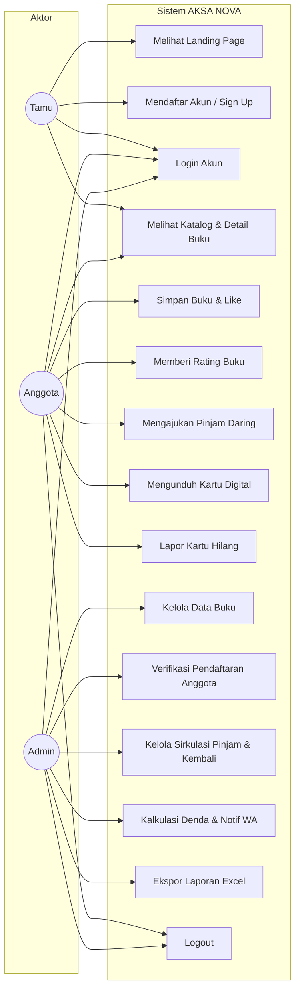
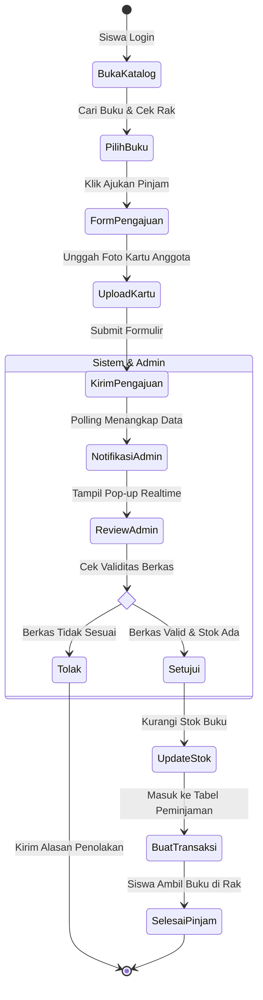
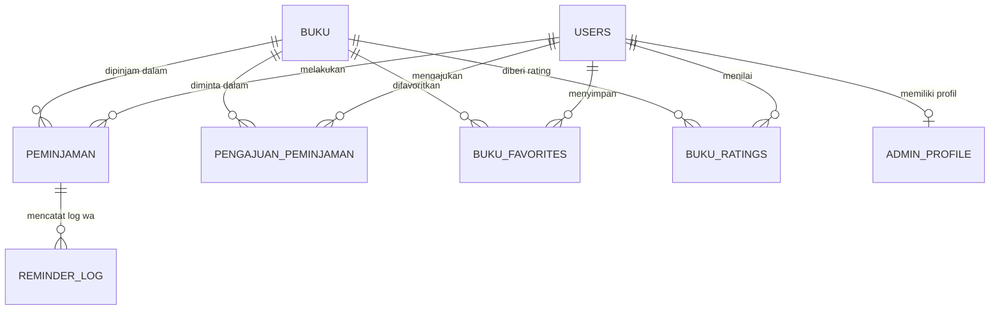

# LAPORAN UJI KOMPETENSI KEAHLIAN (UKK)
## REKAYASA PERANGKAT LUNAK / PENGEMBANGAN PERANGKAT LUNAK DAN GIM (PPLG)
### SISTEM INFORMASI PERPUSTAKAAN DIGITAL BERBASIS WEB (AKSA NOVA)
**SMK NEGERI 1 RONGGA — TAHUN AJARAN 2025/2026**

---

## DAFTAR ISI
1. **BAB I: PENDAHULUAN**
   - 1.1 Latar Belakang Masalah
   - 1.2 Rumusan Masalah
   - 1.3 Batasan Masalah
   - 1.4 Tujuan Pengembangan Sistem
   - 1.5 Manfaat Sistem
2. **BAB II: METODOLOGI PENGEMBANGAN SISTEM (SDLC)**
   - 2.1 Model SDLC yang Digunakan (Waterfall Model)
   - 2.2 Tahapan Pengembangan Sistem
   - 2.3 Jadwal & Alur Pengerjaan
3. **BAB III: ANALISIS KEBUTUHAN SISTEM**
   - 3.1 Profil & Lingkungan Sistem
   - 3.2 Analisis Pengguna (User Persona & Aktor)
   - 3.3 Analisis Kebutuhan Fungsional (Functional Requirements)
   - 3.4 Analisis Kebutuhan Non-Fungsional (Non-Functional Requirements)
   - 3.5 Kebutuhan Perangkat Keras & Perangkat Lunak Minimum
4. **BAB IV: PERANCANGAN SISTEM (DESIGN)**
   - 4.1 Perancangan Alur Sistem (Use Case Diagram & Deskripsi)
   - 4.2 Activity Diagram (Alur Bisnis Utama)
   - 4.3 Perancangan Basis Data (Entity Relationship Diagram & Kamus Data)
   - 4.4 Perancangan Antarmuka (UI/UX Design Concept)
5. **BAB V: IMPLEMENTASI DAN PENGUJIAN SISTEM**
   - 5.1 Implementasi Lingkungan Pengembangan & Struktur File
   - 5.2 Rencana Pengujian (Testing Strategy)
   - 5.3 Hasil Pengujian Fungsionalitas (Black Box Testing)
6. **BAB VI: PENUTUP**
   - 6.1 Kesimpulan
   - 6.2 Saran & Pengembangan Lanjutan
7. **LAMPIRAN**
   - Panduan Penggunaan Singkat (User Guide)

---

# BAB I: PENDAHULUAN

### 1.1 Latar Belakang Masalah
Perpustakaan sekolah merupakan pusat sumber belajar yang memegang peranan krusial dalam meningkatkan literasi dan menunjang kegiatan belajar mengajar di SMK Negeri 1 Rongga. Seiring dengan perkembangan teknologi informasi yang pesat, sistem perpustakaan konvensional yang mengandalkan pencatatan manual di buku besar seringkali menghadapi berbagai kendala operasional, antara lain:
1. **Pencatatan yang Tidak Efisien**: Proses pencatatan peminjaman dan pengembalian buku memerlukan waktu lama dan rentan terhadap kesalahan manusia (*human error*).
2. **Kendala Pelacakan Keterlambatan dan Denda**: Pustakawan kesulitan memantau siswa yang terlambat mengembalikan buku serta menghitung akumulasi denda secara akurat dan transparan.
3. **Keterbatasan Akses Katalog Buku**: Siswa harus datang langsung ke perpustakaan hanya untuk memastikan apakah sebuah buku tersedia atau di mana posisi fisik buku tersebut berada.
4. **Resiko Kehilangan & Pemalsuan Kartu Fisik**: Kartu perpustakaan kertas sering hilang, tertinggal, atau rusak, sehingga memperlambat verifikasi siswa saat bertransaksi.

Untuk mengatasi permasalahan tersebut, dirancang dan dibangun sistem informasi perpustakaan digital berbasis web bernama **AKSA NOVA** (*Library Catalog & Circulation Management System*). Sistem ini mengintegrasikan katalogisasi buku digital, pencarian data buku otomatis (Google Books API via ISBN), peminjaman daring mandiri dengan verifikasi kartu digital, sistem notifikasi *realtime*, perhitungan denda otomatis, integrasi pengingat via WhatsApp, serta pelaporan otomatis format spreadsheet Excel.

### 1.2 Rumusan Masalah
Berdasarkan latar belakang tersebut, rumusan masalah dalam proyek UKK ini adalah:
1. Bagaimana merancang dan membangun sistem informasi perpustakaan berbasis web yang mempermudah sirkulasi peminjaman dan pengembalian buku?
2. Bagaimana mengimplementasikan sistem perhitungan denda keterlambatan secara otomatis dan terintegrasi dengan pesan pengingat WhatsApp?
3. Bagaimana membangun sistem verifikasi anggota berbasis kartu perpustakaan digital ber-QR Code untuk menjamin keabsahan transaksi siswa?
4. Bagaimana menyediakan laporan rekapitulasi data buku dan transaksi sirkulasi yang dapat diekspor langsung ke format Microsoft Excel?

### 1.3 Batasan Masalah
Agar pembahasan terarah dan fokus pada kompetensi keahlian, ruang lingkup proyek dibatasi pada:
1. Sistem berbasis web (*responsive web application*) yang dapat diakses melalui peramban laptop maupun ponsel cerdas.
2. Pengguna terbagi menjadi 3 entitas (Aktor): **Admin (Pustakawan)**, **Anggota (Siswa SMKN 1 Rongga)**, dan **Tamu (Pengunjung Umum)**.
3. Sirkulasi peminjaman mencakup pengajuan daring oleh siswa serta peminjaman langsung di meja layanan oleh admin.
4. Perhitungan denda berjalan secara otomatis dengan tarif harian yang dapat dikonfigurasi fleksibel oleh admin.
5. Pustakawan dapat mengekspor rekapitulasi data transaksi ke dalam format Excel (.xlsx) multilembar.
6. Lingkungan implementasi menggunakan PHP 8.1 Native, basis data MySQL/MariaDB, dan web server Apache (Laragon/XAMPP).

### 1.4 Tujuan Pengembangan Sistem
1. Membangun sistem katalog dan sirkulasi perpustakaan digital yang terotomatisasi, transparan, dan cepat.
2. Membantu pustakawan mengelola data buku, siswa, denda, serta menghasilkan laporan administratif secara otomatis.
3. Memberikan kemudahan bagi siswa dalam mencari buku, mengetahui lokasi rak fisik buku, dan memantau status pinjamannya secara mandiri.
4. Memenuhi kriteria standar kelulusan Uji Kompetensi Keahlian (UKK) Rekayasa Perangkat Lunak / PPLG dengan menerapkan prinsip *clean code*, keamanan data, dan desain antarmuka yang modern.

### 1.5 Manfaat Sistem
* **Bagi Pustakawan / Sekolah**: Mengurangi beban kerja manual, mempercepat pembuatan laporan bulanan, mencegah buku hilang, dan meningkatkan akuntabilitas pengelolaan denda.
* **Bagi Siswa**: Memberikan pengalaman literasi digital yang interaktif (fitur ulasan rating, like, favorit), serta mempermudah peminjaman buku tanpa antrean panjang.
* **Bagi Penulis / Pengembang**: Mengasah keterampilan analisis perangkat lunak (SDLC), perancangan basis data relasional (ERD), pemrograman web dinamis, serta pengujian sistem secara komprehensif.

---

# BAB II: METODOLOGI PENGEMBANGAN SISTEM (SDLC)

### 2.1 Model SDLC yang Digunakan (Waterfall Model)
Pengembangan sistem informasi **AKSA NOVA** menerapkan metodologi **Waterfall (Air Terjun)** menurut standar Pressman/Sommerville. Metode ini dipilih karena kebutuhan fungsional sistem perpustakaan sekolah telah terdefinisi secara jelas sejak awal (analisis regulasi perpustakaan sekolah) dan memerlukan dokumentasi terstruktur untuk pemenuhan portofolio UKK.

```
[1. Requirements Analysis]
           ↓
   [2. System & Database Design]
           ↓
      [3. Implementation / Coding]
              ↓
         [4. Testing (Black Box)]
                 ↓
            [5. Deployment & Maintenance]
```

### 2.2 Tahapan Pengembangan Sistem

1. **Analisis Kebutuhan (Requirements Analysis)**:
   - Mengidentifikasi masalah sirkulasi manual di SMKN 1 Rongga.
   - Mengumpulkan data atribut buku, aturan batas peminjaman (maks. 7–14 hari), serta formula penghitungan denda harian.
   - Menyusun dokumen spesifikasi kebutuhan perangkat lunak (SRS / PRD).

2. **Perancangan Sistem (Design)**:
   - Merancang diagram pemodelan menggunakan UML: *Use Case Diagram*, *Activity Diagram*, dan *Skenario Use Case*.
   - Merancang basis data: Pemodelan relasional (*Entity Relationship Diagram* - ERD), normalisasi 3NF, dan penyusunan kamus data (*data dictionary*).
   - Merancang antarmuka pengguna (*User Interface Mockup*) dengan palet warna modern bertema **Obsidian-Gold** (`#090c10` dan `#d8b878`) untuk menjamin kenyamanan visual (*ergonomic dark mode*).

3. **Implementasi / Pengodean (Implementation)**:
   - Penulisan program modular berbasis PHP Native (Prosedural terstruktur & PDO/MySQLi Prepared Statements).
   - Pembangunan antarmuka responsif menggunakan HTML5, CSS Flexbox/Grid modern, dan Vanilla JavaScript (ES6+).
   - Integrasi API publik (Google Books API untuk pencarian ISBN otomatis) dan Web APIs (Web Audio API & Canvas API untuk kartu digital).

4. **Pengujian Sistem (Testing)**:
   - Melakukan verifikasi sintaksis menyeluruh (`php -l`).
   - Melakukan pengujian fungsionalitas menggunakan metode **Black Box Testing** untuk menguji input, tombol aksi, hak akses role, serta validasi form login, pendaftaran NIS, kalkulasi denda, dan ekspor data.

5. **Penyebaran & Pemeliharaan (Deployment & Maintenance)**:
   - Konfigurasi basis data pada server lokal (Laragon/MySQL) dengan enkripsi password menggunakan algoritma `PASSWORD_BCRYPT`.
   - Dokumentasi laporan teknis dan pembuatan petunjuk pengoperasian (*user manual*).

---

# BAB III: ANALISIS KEBUTUHAN SISTEM

### 3.1 Profil & Lingkungan Sistem
Sistem AKSA NOVA dirancang khusus untuk memenuhi standar digitalisasi perpustakaan SMK Negeri 1 Rongga. Seluruh komunikasi antarmuka menggunakan Bahasa Indonesia yang komunikatif, didukung fitur aksesibilitas berupa *zoom text*, pengaturan tema kontras tinggi, dan *background audio controller*.

### 3.2 Analisis Pengguna (Aktor)
Sistem memiliki 3 tingkatan aktor:

| Aktor | Deskripsi Peran & Tanggung Jawab |
|---|---|
| **Admin (Pustakawan)** | Pengelola penuh sistem: mengelola inventaris buku, memverifikasi akun siswa baru, menyetujui pengajuan pinjam daring, memproses transaksi pengembalian, mencatat pelunasan denda, mengonfigurasi musik dan banner, serta mengunduh laporan rekapitulasi Excel. |
| **Anggota (Siswa)** | Siswa SMKN 1 Rongga yang telah disetujui akunnya: dapat melihat katalog, melihat lokasi rak fisik buku, menyimpan buku favorit, memberi rating bintang 1–5, mengajukan peminjaman mandiri, memantau riwayat pinjam, serta mengunduh kartu perpustakaan digital ber-QR Code. |
| **Tamu (Guest)** | Pengunjung yang belum memiliki akun/belum login: dapat menjelajahi halaman depan (landing page), membaca informasi profil sekolah, serta mencari dan melihat informasi detail buku. Akses transaksi peminjaman dibatasi. |

### 3.3 Analisis Kebutuhan Fungsional (Functional Requirements)

1. **Modul Autentikasi & Akun**:
   - **FR-01**: Pendaftaran akun siswa dengan validasi NIS unik, kelas, nama, email, nomor HP, dan password. Status akun awal bernilai `pending`.
   - **FR-02**: Admin dapat menyetujui (`approved`) atau menolak (`rejected`) akun pendaftar baru.
   - **FR-03**: Pembuatan kartu anggota digital otomatis lengkap dengan QR Code identitas unik dan tombol cetak/unduh gambar kartu.
   - **FR-04**: Fitur pelaporan kartu hilang (`lupa_kartu.php`) untuk membekukan akun lama dan mengajukan kartu pengganti.
   - **FR-05**: Pengelolaan profil admin (ganti nama tampilan, foto avatar, dan reset kata sandi admin).

2. **Modul Katalog & Inventaris Buku**:
   - **FR-06**: CRUD data buku (Judul, Penulis, ISBN, Genre, Sinopsis, Stok Fisik, Lokasi Rak, dan Gambar Sampul).
   - **FR-07**: Fitur pencarian otomatis data buku berdasarkan nomor ISBN melalui integrasi API eksternal (Google Books).
   - **FR-08**: Pencarian dinamis (*live search*) dan filter kategori multi-genre pada katalog buku.
   - **FR-09**: Penayangan detail informasi lokasi rak fisik buku (misal: "Rak A-2 Fiksi") untuk mempermudah navigasi fisik di perpustakaan.

3. **Modul Interaksi Siswa (Engagement)**:
   - **FR-10**: Siswa dapat menyukai buku (*like*) dan menyimpan ke daftar buku favorit (*bookmark*).
   - **FR-11**: Siswa dapat memberikan rating bintang (skala 1–5) pada buku. Admin dicegah memberikan rating (*read-only average*).

4. **Modul Sirkulasi Peminjaman & Pengembalian**:
   - **FR-12**: Siswa dapat mengajukan peminjaman buku secara daring dengan mengunggah gambar kartu perpustakaan sebagai validasi.
   - **FR-13**: Sistem notifikasi *realtime* pop-up modal beranimasi dan bersuara di layar admin saat ada pengajuan baru yang masuk.
   - **FR-14**: Admin dapat memproses peminjaman langsung di tempat (*offline circulation*).
   - **FR-15**: Admin dapat memproses pengembalian buku dengan perhitungan otomatis status keterlambatan (hari terlambat $\times$ tarif denda).
   - **FR-16**: Integrasi penagihan denda keterlambatan via tombol WhatsApp Web API langsung ke nomor siswa bersangkutan.

5. **Modul Dashboard & Pelaporan**:
   - **FR-17**: Dashboard Admin menyajikan statistik ringkas (total buku, eksemplar tersedia, peminjam aktif, dan denda tertunggak).
   - **FR-18**: Fitur ekspor laporan lengkap ke format Microsoft Excel (.xlsx) yang terdiri dari lembar ringkasan, data sirkulasi, dan inventaris buku.

### 3.4 Analisis Kebutuhan Non-Fungsional (Non-Functional Requirements)

1. **Keamanan (Security)**:
   - Enkripsi kata sandi menggunakan fungsi hashing standar industri `password_hash()` (Bcrypt).
   - Pencegahan serangan SQL Injection menggunakan *Prepared Statements* (MySQLi parameter binding).
   - Sanitasi input form terhadap serangan Cross-Site Scripting (XSS) dengan `htmlspecialchars()`.
   - Pembatasan akses halaman berbasis hak akses sesi (`$_SESSION['role']`).
2. **Kinerja & Kecepatan (Performance)**:
   - Pemuatan halaman di bawah 2 detik pada jaringan lokal.
   - Optimalisasi aset gambar dan kompresi file upload cover buku maksimal 5 MB.
3. **Kegunaan & Aksesibilitas (Usability)**:
   - Antarmuka responsif (*mobile-friendly*) dengan tata letak adaptif pada perangkat seluler, tablet, dan desktop.
   - Panel preferensi tampilan: pengaturan kontras warna (Obsidian Gold & Light), ukuran font dinamis, dan kontrol pemutaran audio latar yang tidak terputus saat berpindah halaman (*AksaAudio persistent playback*).

### 3.5 Kebutuhan Perangkat Keras & Perangkat Lunak Minimum

* **Perangkat Lunak Pengembang & Server (Minimum)**:
  * Sistem Operasi: Windows 10/11, Linux Ubuntu 20.04+, atau macOS.
  * Web Server: Apache 2.4+ (Laragon / XAMPP).
  * Bahasa Pemrograman: PHP versi 8.1+.
  * Database Management System: MySQL versi 8.0+ atau MariaDB 10.4+.
  * Web Browser: Google Chrome, Mozilla Firefox, atau Microsoft Edge versi terbaru.
  * Code Editor: Visual Studio Code.
* **Perangkat Keras Minimum (Client & Server)**:
  * Processor: Intel Core i3 / AMD Ryzen 3 (setara atau di atasnya).
  * RAM: Minimal 4 GB (disarankan 8 GB).
  * Penyimpanan: Hard Disk / SSD dengan ruang kosong minimal 2 GB.
  * Monitor: Resolusi minimal 1366 × 768 piksel.

---

# BAB IV: PERANCANGAN SISTEM (DESIGN)

### 4.1 Perancangan Alur Sistem (Use Case Diagram)

Sistem AKSA NOVA membagi interaksi fungsional ke dalam 3 aktor utama:



#### Skenario Use Case Utama (Contoh: Pengajuan Peminjaman Daring)
* **Use Case**: Mengajukan Pinjaman Buku Daring (`pengajuan_peminjaman.php`)
* **Aktor Utama**: Anggota (Siswa)
* **Kondisi Awal (Pre-condition)**: Siswa telah login dan memiliki akun berstatus aktif.
* **Skenario Normal**:
  1. Siswa menelusuri katalog buku dan memilih buku yang stoknya $> 0$.
  2. Siswa menekan tombol "Ajukan Peminjaman".
  3. Sistem menampilkan formulir pengajuan peminjaman berisi informasi buku, tanggal kembali otomatis, dan pilihan waktu pengambilan.
  4. Siswa mengunggah foto kartu anggota perpustakaan sebagai bukti kepemilikan sah.
  5. Siswa menekan tombol "Kirim Pengajuan".
  6. Sistem memvalidasi berkas gambar dan menyimpan pengajuan dengan status `menunggu`.
  7. Sistem menampilkan notifikasi sukses dan modal realtime muncul di layar admin.
* **Kondisi Akhir (Post-condition)**: Pengajuan tersimpan di basis data, siap diverifikasi admin, dan stok belum berkurang sampai admin menyetujuinya.

---

### 4.2 Activity Diagram (Alur Bisnis Sirkulasi Peminjaman)



---

### 4.3 Perancangan Basis Data (ERD & Kamus Data)

Basis data relasional sistem AKSA NOVA diberi nama `aksa_nova` dengan engine penyimpanan **InnoDB** dan karakter set **utf8mb4**.

#### Visualisasi ERD


#### Kamus Data Entitas Utama (Data Dictionary)

1. **Tabel `users`** (Menyimpan data akun pengguna):
   * `id` (INT, PK, Auto Increment): ID unik pengguna.
   * `full_name` (VARCHAR 100): Nama lengkap pengguna/siswa.
   * `nik` (VARCHAR 20): Nomor Induk Siswa (NIS) atau NIK.
   * `kelas` (VARCHAR 30): Nama kelas (contoh: "XII RPL 1").
   * `no_hp` (VARCHAR 20): Nomor WhatsApp untuk kontak dan tagihan.
   * `no_anggota` (VARCHAR 30, Unique): Nomor kartu perpustakaan resmi (format: `AN-YYYYMM-XXXX`).
   * `username` (VARCHAR 50, Unique): Username login.
   * `email` (VARCHAR 100, Unique): Alamat surel siswa/admin.
   * `password` (VARCHAR 255): Hash kata sandi terenkripsi (Bcrypt).
   * `role` (ENUM: `'admin'`, `'member'`): Hak akses sistem.
   * `status` (ENUM: `'pending'`, `'approved'`, `'rejected'`): Status aktivasi pendaftaran.
   * `card_status` (ENUM: `'active'`, `'frozen'`): Status keaktifan kartu anggota.
   * `created_at` (TIMESTAMP): Waktu registrasi akun.

2. **Tabel `buku`** (Menyimpan katalog inventaris buku):
   * `id` (INT, PK, Auto Increment): ID unik buku.
   * `judul` (VARCHAR 200): Judul buku.
   * `penulis` (VARCHAR 100): Penulis/pengarang buku.
   * `isbn` (VARCHAR 50): Kode standar buku internasional.
   * `genre` (VARCHAR 60): Kategori/genre buku.
   * `sinopsis` (TEXT): Ringkasan isi buku.
   * `stok` (INT): Jumlah eksemplar fisik yang tersedia.
   * `rak` (VARCHAR 50): Lokasi rak fisik buku di perpustakaan (contoh: "Rak B-1").
   * `gambar` (VARCHAR 255): Lokasi file sampul buku.

3. **Tabel `pengajuan_peminjaman`** (Menyimpan antrean pengajuan daring):
   * `id` (INT, PK, Auto Increment): ID pengajuan.
   * `user_id` (INT, FK ke `users.id`): Siswa yang mengajukan.
   * `buku_id` (INT, FK ke `buku.id`): Buku yang diajukan.
   * `jumlah` (INT): Jumlah buku yang diajukan.
   * `tgl_kembali` (DATE): Rencana batas pengembalian.
   * `file_kartu` (VARCHAR 255): Berkas upload foto kartu anggota siswa.
   * `status` (ENUM: `'menunggu'`, `'disetujui'`, `'ditolak'`): Status verifikasi admin.
   * `created_at` (TIMESTAMP): Waktu pengajuan dikirim.

4. **Tabel `peminjaman`** (Menyimpan transaksi sirkulasi aktif & riwayat):
   * `id` (INT, PK, Auto Increment): ID transaksi.
   * `user_id` (INT, FK ke `users.id`): Siswa peminjam.
   * `buku_id` (INT, FK ke `buku.id`): Buku yang dipinjam.
   * `tgl_pinjam` (DATE): Tanggal buku diserahkan.
   * `batas_kembali` (DATE): Tanggal tenggat pengembalian buku.
   * `tgl_dikembalikan` (DATETIME, Nullable): Tanggal riil buku dikembalikan.
   * `status` (ENUM: `'dipinjam'`, `'dikembalikan'`, `'terlambat'`): Status sirkulasi.
   * `denda` (DECIMAL 10,2): Jumlah denda keterlambatan (Rp).
   * `status_denda` (ENUM: `'lunas'`, `'belum'`): Status pembayaran denda.

---

### 4.4 Perancangan Antarmuka (UI/UX Design Concept)

1. **Konsep Visual Obsidian-Gold**:
   * Warna Dasar (Background): Gelap elegan (`#090c10`), warna kartu (`#121820`), teks utama (`#eef3f4`).
   * Warna Aksen (Accent): Gold kemilau (`#d8b878`) untuk tombol aksi, sorotan status, dan border bercahaya.
   * Tipografi: Google Font `Outfit` (modern, tegas, dan mudah dibaca) berpadu dengan `Nunito` untuk teks isi.
2. **Desain Komponen Utama**:
   * **HUD Topbar & Sidebar Navigation**: Menampilkan indikator status pengguna, kontrol musik latar persisten, tombol aksesibilitas, serta drawer navigasi yang mulus di perangkat mobile.
   * **Modal Detail Buku**: Menampilkan cover buku resolusi tinggi, chip kategori, badge ketersediaan stok warna dinamis (Hijau = Tersedia, Kuning = Terbatas, Merah = Habis), informasi lokasi rak buku, ulasan bintang rata-rata, dan tombol pinjam interaktif.
   * **Pop-up Notifikasi Admin Realtime**: Modal berukuran besar dengan latar belakang blur (*backdrop blur*), dilengkapi animasi pulse dan pemutar lonceng harmonik Web Audio API saat terdeteksi data pengajuan baru.

---

# BAB V: IMPLEMENTASI DAN PENGUJIAN SISTEM

### 5.1 Implementasi Struktur File Program

Proyek dibangun secara modular dalam direktori `aksanovaphp_revisi_hell_hihi/`:
* `index.php`: Halaman depan (Landing page) interaktif dengan banner carousel, audio latar, profil sekolah, dan ganti bahasa.
* `sign_in.php` & `sign_up.php`: Modul autentikasi login dan pendaftaran anggota dengan verifikasi NIS.
* `beranda.php`: Dashboard utama katalog buku dengan filter live search multi-genre dan modal detail.
* `kartu_anggota.php` & `edit_kartu.php`: Generator kartu anggota perpustakaan digital ber-QR Code dan cetak kartu.
* `pengajuan_peminjaman.php`: Antarmuka pengajuan peminjaman daring oleh siswa dengan validasi upload berkas kartu.
* `halaman_admin.php`: Panel manajemen katalog inventaris buku (CRUD & ISBN Auto-Lookup).
* `daftar_anggota.php`: Panel manajemen aktivasi keanggotaan dan reset password siswa.
* `pinjam_buku.php` & `telah_dipinjam.php`: Modul transaksi sirkulasi peminjaman langsung, pengembalian, dan kalkulasi denda.
* `notifikasi_pengajuan_admin.php`: Modul polling realtime modal notifikasi pengajuan baru untuk admin.
* `export_excel_dashboard.php`: Engine ekspor laporan rekapitulasi data format Microsoft Excel.
* `pengaturan_denda.php` & `pengaturan_musik.php`: Modul konfigurasi sistem perpustakaan oleh admin.
* `settings_include.php`: Library CSS tokens global, pengelola audio latar persisten (*AksaAudio*), dan navigasi responsif.

---

### 5.2 Rencana Pengujian (Testing Strategy)
Pengujian sistem dilakukan dengan teknik **Black Box Testing** (Pengujian Kotak Hitam). Fokus pengujian dititikberatkan pada pemenuhan fungsi-fungsi spesifikasi sistem tanpa melihat kode internal, mencakup:
1. Validasi input dan keamanan form pendaftaran & autentikasi.
2. Keakuratan pencarian buku ISBN via API.
3. Alur persetujuan pengajuan pinjam daring dan pergerakan stok buku.
4. Ketepatan rumus kalkulasi denda keterlambatan pengembalian buku.
5. Fungsionalitas ekspor file laporan Excel.

---

### 5.3 Hasil Pengujian Fungsionalitas (Black Box Testing)

| No | Komponen / Skenario Uji | Prosedur Uji | Hasil yang Diharapkan | Hasil Uji | Status |
|---|---|---|---|---|---|
| **1** | Pendaftaran Anggota (`sign_up.php`) | Menginput NIS duplikat atau NIS kurang dari 3 digit angka. | Sistem menolak pendaftaran dan memunculkan pesan error validasi NIS. | Pendaftaran ditolak; pesan "NIS sudah terdaftar" muncul. | **VALID (PASSED)** |
| **2** | Autentikasi Login (`sign_in.php`) | Memasukkan username dan password yang benar. | Sistem mengarahkan pengguna ke halaman Beranda sesuai role (Admin/Member). | Berhasil masuk ke sistem dengan sesi hak akses yang benar. | **VALID (PASSED)** |
| **3** | Blokir Akses Anggota Pending | Login dengan akun yang statusnya masih `pending`. | Sistem menampilkan peringatan bahwa akun menunggu aktivasi pustakawan. | Pengguna tidak dapat meminjam buku sebelum di-approve. | **VALID (PASSED)** |
| **4** | Pencarian ISBN Otomatis (`cari_isbn.php`) | Admin mengetikkan nomor ISBN buku lalu menekan Enter / Cari. | Sistem mengambil judul, pengarang, sinopsis, dan cover dari Google Books API secara otomatis. | Formulir buku terisi otomatis dengan data dari server API. | **VALID (PASSED)** |
| **5** | Pengajuan Pinjam Daring (`pengajuan_peminjaman.php`) | Siswa mengajukan pinjaman tanpa melampirkan berkas foto kartu anggota. | Sistem menolak proses pengajuan dan meminta unggah berkas kartu. | Pengajuan ditolak dengan pesan "Foto kartu anggota wajib diunggah". | **VALID (PASSED)** |
| **6** | Notifikasi Realtime Admin (`notifikasi_pengajuan_admin.php`) | Siswa mengirimkan pengajuan peminjaman yang valid. | Modal notifikasi beranimasi pop-up dan berbunyi lonceng seketika di layar admin. | Pop-up muncul otomatis dalam waktu $\le 1$ detik tanpa reload halaman. | **VALID (PASSED)** |
| **7** | Sirkulasi Stok Atomic | Admin menekan tombol "Setujui" pada pengajuan peminjaman. | Data masuk ke tabel peminjaman dan stok buku fisik berkurang sebanyak 1. | Status pengajuan berubah jadi disetujui; stok buku berkurang secara konsisten. | **VALID (PASSED)** |
| **8** | Proteksi Rating Buku Admin (`rating_handler.php`) | Akun dengan role `admin` mencoba memberikan rating bintang pada buku. | Input bintang disembunyikan di UI dan API menolak dengan HTTP 403 Forbidden. | Admin tidak dapat memberikan rating buku (hanya member). | **VALID (PASSED)** |
| **9** | Kalkulasi Denda Otomatis (`telah_dipinjam.php`) | Memproses pengembalian buku yang melewati batas tanggal tenggat 3 hari (tarif Rp 1.000/hari). | Sistem otomatis menghitung denda keterlambatan sebesar Rp 3.000. | Denda terhitung tepat Rp 3.000 dan tombol WhatsApp penagihan aktif. | **VALID (PASSED)** |
| **10** | Pengingat WhatsApp | Admin menekan tombol ikon WhatsApp pada data peminjam terlambat. | Membuka tautan `api.whatsapp.com` dengan pesan tagihan yang sudah terformat rapi. | WhatsApp Web terbuka dengan template nama siswa, judul buku, dan nominal denda. | **VALID (PASSED)** |
| **11** | Ekspor Laporan Excel (`export_excel_dashboard.php`) | Admin menekan tombol "Ekspor Excel" pada dashboard rekap. | Sistem mengunduh berkas `.xlsx` multilembar berisi data buku, peminjam, dan denda. | Berkas Excel berhasil terunduh dan dapat dibuka sempurna di MS Excel. | **VALID (PASSED)** |
| **12** | Kelangsungan Audio Latar (*AksaAudio*) | Pengguna berpindah dari halaman Beranda ke Daftar Buku atau Edit Profil. | Musik latar tetap berputar melanjutkan detik pemutaran terakhir tanpa mengulang dari 00:00. | Musik berputar kontinu secara persisten (*seamless playback*). | **VALID (PASSED)** |

---

# BAB VI: PENUTUP

### 6.1 Kesimpulan
Berdasarkan seluruh tahapan perancangan, implementasi, dan pengujian yang telah dilaksanakan pada proyek **Sistem Informasi Perpustakaan Digital (AKSA NOVA)** untuk Uji Kompetensi Keahlian (UKK), dapat disimpulkan bahwa:
1. Sistem berhasil mendigitalkan seluruh siklus pengelolaan perpustakaan di SMK Negeri 1 Rongga, mulai dari katalogisasi buku, pencarian lokasi rak fisik, hingga pelaporan otomatis.
2. Penerapan arsitektur web modern dengan PHP Native dan basis data relasional MySQL menghasilkan sistem yang cepat, ringan, dan aman tanpa ketergantungan framework yang rumit.
3. Fitur pengajuan daring terbukti andal dengan adanya verifikasi kartu anggota digital ber-QR Code serta notifikasi pop-up *realtime* di layar admin.
4. Mekanisme penghitungan denda keterlambatan berjalan akurat dan terintegrasi dengan pengingat WhatsApp, mempermudah pustakawan menertibkan sirkulasi buku.
5. Berdasarkan hasil pengujian *Black Box Testing*, seluruh 12 parameter pengujian fungsional dinyatakan **100% Valid (Passed)** dan siap diujikan di hadapan tim penguji UKK.

### 6.2 Saran & Pengembangan Lanjutan
Untuk pengembangan sistem AKSA NOVA di masa mendatang, disarankan beberapa peningkatan berikut:
1. **Fitur Scanner Kamera Langsung**: Menambahkan pembaca barcode/QR Code langsung melalui webcam laptop atau kamera HP pada halaman sirkulasi admin untuk mempercepat pemindaian kartu fisik.
2. **Katalog Buku Digital (E-Book Reader)**: Mengintegrasikan pembaca dokumen PDF terenkripsi agar siswa dapat membaca buku elektronik secara legal langsung di peramban web.
3. **Pemberitahuan Otomatis via WhatsApp Gateway / SMS**: Menerapkan integrasi WhatsApp API otomatis (*webhook/cron*) agar pesan peringatan jatuh tempo terkirim secara mandiri 1 hari sebelum batas pengembalian.

---

# LAMPIRAN: PANDUAN PENGGUNAAN SINGKAT (USER GUIDE)

### A. Alur Kerja untuk Pustakawan (Admin)
1. Buka peramban dan akses alamat `http://localhost/aksanovaphp_revisi_hell_hihi/sign_in.php`.
2. Masukkan akun admin default (`admin` / kata sandi admin).
3. Untuk menambah buku baru: Masuk ke menu **Action Admin (Perbarui Buku)** $\rightarrow$ Masukkan ISBN dan klik **Cari ISBN** untuk mengisi metadata otomatis $\rightarrow$ Tentukan lokasi rak buku dan simpan.
4. Untuk menyetujui anggota baru: Buka menu **Daftar Anggota** $\rightarrow$ Periksa data pendaftar pada tab *Pending* $\rightarrow$ Klik tombol **Setujui**.
5. Untuk melayani sirkulasi pengembalian: Buka menu **Telah Dipinjam** $\rightarrow$ Temukan transaksi peminjam $\rightarrow$ Klik **Kembalikan** (sistem otomatis menampilkan jumlah denda jika terlambat).

### B. Alur Kerja untuk Siswa (Anggota)
1. Akses halaman utama $\rightarrow$ Klik **Daftar (Sign Up)** jika belum memiliki akun $\rightarrow$ Isi data diri lengkap termasuk NIS dan kelas.
2. Tunggu akun disetujui pustakawan perpustakaan.
3. Setelah disetujui, login melalui halaman **Sign In**.
4. Buka menu **Kartu Anggota** untuk mengunduh dan mencetak kartu perpustakaan digital Anda.
5. Cari buku yang diminati di **Beranda** atau **Daftar Buku** $\rightarrow$ Klik sampul buku untuk melihat detail dan nomor rak buku.
6. Klik **Ajukan Peminjaman** $\rightarrow$ Unggah foto kartu perpustakaan Anda $\rightarrow$ Ambil buku fisik di perpustakaan sekolah sesuai jadwal.
