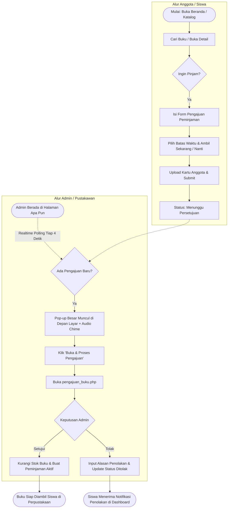

# Product Requirements Document (PRD)
## Sistem Informasi Perpustakaan Digital — AKSA NOVA

---

## 1. Executive Summary & Overview

### 1.1 Latar Belakang & Visi Produk
**AKSA NOVA** adalah sistem informasi perpustakaan digital modern berbasis web yang dirancang untuk mendigitalkan seluruh ekosistem perpustakaan sekolah/institusi, mulai dari sirkulasi buku (peminjaman & pengembalian), penagihan denda keterlambatan terintegrasi WhatsApp, manajemen keanggotaan berbasis kartu digital, hingga interaksi literasi (like, favorit, rating).

Aplikasi mengusung identitas visual premium **Obsidian-Gold Luxury Theme** (gelap elegan beraksen emas `#d8b878` dan mode terang adaptif), dilengkapi musik latar persisten (*seamless persistent background audio*), serta transisi halaman mulus berbasis *View Transitions API*.

### 1.2 Tujuan Produk (Product Goals)
- **Efisiensi Pustakawan**: Mengurangi beban kerja administratif manual melalui pencatatan sirkulasi digital, kalkulasi denda otomatis, notifikasi pop-up besar realtime saat ada pengajuan baru, dan pencarian ISBN otomatis.
- **Kenyamanan Anggota**: Memberikan pengalaman mandiri bagi siswa/anggota dalam mencari katalog buku, mengajukan peminjaman online (*Ambil Sekarang* / *Ambil Nanti*), menyimpan buku favorit, memberikan ulasan rating, dan mengunduh kartu anggota digital.
- **Transparansi & Akuntabilitas**: Menghindari sengketa keterlambatan pengembalian buku dengan pencatatan `waktu_pinjam`, `batas_kembali`, `terlambat_hari`, status denda, serta riwayat pengingat WhatsApp (`reminder_log`).

---

## 2. Stakeholders & User Personas

| Persona | Hak Akses (Role) | Karakteristik & Kebutuhan Utama |
|---|---|---|
| **Admin / Pustakawan** | `role: admin` | • Mengelola katalog buku (tambah, edit, stok, ISBN fetch). • Memvalidasi pendaftaran anggota & pengajuan peminjaman. • Memproses sirkulasi peminjaman, pengembalian, & pelunasan denda. • Mengatur banner beranda, tarif denda, musik latar, dan profil admin. • Menerima notifikasi pop-up realtime saat ada siswa mengajukan pinjaman. |
| **Anggota / Siswa** | `role: member` | • Menelusuri buku berdasarkan genre, judul, atau penulis. • Mengajukan peminjaman buku dari mana saja secara online. • Memiliki kartu anggota digital resmi (dapat dicetak / disimpan). • Menyimpan buku ke daftar simpanan dan menyukai buku. • Memberikan rating bintang (1–5) pada buku yang telah dibaca. • Memeriksa riwayat pinjaman aktif, tenggat waktu, dan denda personal. |
| **Pengunjung / Tamu** | `guest` | • Melihat katalog umum, informasi buku, dan banner promosi. • Diarahkan untuk mendaftar (`sign_up.php`) atau masuk (`sign_in.php`) saat hendak melakukan aksi peminjaman atau interaksi. |

---

## 3. Fitur Utama & Kebutuhan Fungsional (Functional Requirements)

### 3.1 Manajemen Autentikasi & Akun
- **FR-AUTH-01 (Pendaftaran Anggota)**: Pengguna dapat mendaftar dengan menginput Nama Lengkap, NIK, Kelas, No. WhatsApp, Username, Email, Kata Sandi, dan Foto Profil.
- **FR-AUTH-02 (Nomor Anggota Otomatis)**: Sistem otomatis men-generate Nomor Anggota unik (format: `AN-YYYYMM-XXXX`).
- **FR-AUTH-03 (Verifikasi Pustakawan)**: Akun baru berstatus `pending` dan harus disetujui (`approved`) oleh admin sebelum dapat meminjam buku.
- **FR-AUTH-04 (Kartu Anggota Digital)**: Anggota yang disetujui dapat mengunduh dan mencetak Kartu Anggota Perpustakaan dengan QR/Barcode dan identitas lengkap (`kartu_anggota.php`, `edit_kartu.php`).
- **FR-AUTH-05 (Lupa Kartu / Freeze Card)**: Mekanisme pelaporan kartu hilang/lupa (`lupa_kartu.php`) yang membekukan status kartu (`card_status = 'frozen'`) untuk mencegah penyalahgunaan.
- **FR-AUTH-06 (Profil & Ganti Sandi Admin)**: Admin dapat mengubah display name, foto avatar, dan mengganti kata sandi secara aman dari modal universal (`modal_profil_admin.php`).

### 3.2 Katalog & Inventaris Buku
- **FR-BOOK-01 (Katalogisasi & Metadata)**: Buku memiliki judul, penulis, ISBN, genre/kategori, sinopsis, jumlah stok fisik, dan gambar sampul.
- **FR-BOOK-02 (Pencarian ISBN Otomatis)**: Admin dapat mencari data buku dan mengunduh cover otomatis menggunakan Google Books / Open Library API (`cari_isbn.php`).
- **FR-BOOK-03 (Pencarian Live & Filter Genre)**: Pengguna dapat mencari buku secara instan (*debounced live search*) dan memfilter berdasarkan multi-genre.
- **FR-BOOK-04 (Stok Atomic)**: Sistem menjamin stok buku berkurang secara konsisten saat disetujui dan bertambah kembali saat buku dikembalikan.

### 3.3 Alur Pengajuan & Sirkulasi Peminjaman
- **FR-LOAN-01 (Pengajuan Online oleh Anggota)**:
  - Anggota memilih buku dan menentukan jumlah eksemplar, batas kembali (maksimal 7–14 hari sesuai kebijakan), serta opsi waktu pengambilan (*Ambil Sekarang* / *Ambil Nanti* dengan catatan waktu).
  - Mengunggah bukti kartu anggota sebagai validasi.
  - Data tersimpan dengan status `menunggu`.
- **FR-LOAN-02 (Notifikasi Pop-up Besar Realtime Admin)**:
  - Setiap ada pengajuan buku baru, pop-up modal beranimasi besar muncul seketika di layar admin di halaman mana pun admin berada.
  - Disertai suara lonceng harmonik (*Web Audio API*) dan badge berkedip.
  - Menyediakan tombol cepat **"Buka & Proses Pengajuan"** menuju `pengajuan_buku.php`.
- **FR-LOAN-03 (Persetujuan & Penolakan Pengajuan)**:
  - Admin dapat menyetujui pengajuan jika stok mencukupi (otomatis masuk ke tabel `peminjaman` dan stok buku berkurang).
  - Jika ditolak, admin menyertakan alasan penolakan yang dapat dilihat oleh siswa di dashboard mereka.
- **FR-LOAN-04 (Peminjaman Langsung di Tempat)**:
  - Admin dapat langsung membuat transaksi peminjaman langsung bagi siswa yang datang ke meja sirkulasi (`pinjam_buku.php`).

### 3.4 Pengembalian Buku & Denda Keterlambatan
- **FR-RET-01 (Pencatatan Pengembalian)**: Admin memproses pengembalian buku di `telah_dipinjam.php`. Sistem mencatat `waktu_kembali` dan mengembalikan stok fisik buku.
- **FR-RET-02 (Perhitungan Denda Otomatis)**: Jika `waktu_kembali > batas_kembali`, sistem menghitung selisih hari (`terlambat_hari`) dikalikan tarif denda harian (default Rp 1.000/hari) dan mengubah `status_denda = 'belum_bayar'`.
- **FR-RET-03 (Pelunasan Denda)**: Admin dapat memvalidasi pembayaran denda dan mengubah status menjadi `lunas`.
- **FR-RET-04 (Pengingat WhatsApp Otomatis)**: Integrasi template pengingat via WhatsApp URL / gateway kepada nomor siswa yang terlambat, tercatat di `reminder_log`.

### 3.5 Interaksi Anggota (Social & Engagement)
- **FR-ENG-01 (Buku Favorit / Simpan)**: Anggota dapat menyimpan buku untuk dibaca nanti (`buku_favorites`).
- **FR-ENG-02 (Suka / Like)**: Anggota dapat menyukai buku (`buku_likes`) dengan counter like interaktif.
- **FR-ENG-03 (Rating Bintang 1–5)**:
  - Anggota dapat memberikan rating 1 sampai 5 bintang beserta pembaruan rata-rata rating buku.
  - **Aturan Bisnis Khusus**: Role `admin` diblokir dari memberikan rating guna menjaga objektivitas ulasan murni dari pembaca.

### 3.6 Konfigurasi Sistem & Pengaturan
- **FR-CFG-01 (Kelola Banner)**: Admin dapat mengatur slide promosi/kegiatan perpustakaan pada beranda (`kelola_banner.php`).
- **FR-CFG-02 (Pengaturan Denda & Aturan)**: Pengaturan tarif denda dan batas maksimal peminjaman tersimpan di tabel dinamis `pengaturan`.
- **FR-CFG-03 (Musik Latar Berkelanjutan)**: Admin dapat mengunggah file audio latar dan mengatur lagu aktif yang berputar terus-menerus tanpa terputus saat pengguna berpindah halaman (`pengaturan_musik.php` & `AksaAudio`).
- **FR-CFG-04 (Panel Preferensi Tema)**: Pengguna dapat menyesuaikan font (Outfit, Nunito, Poppins, dll.), tema warna (Emas, Biru, Ungu, dll.), dan dark/light mode (`pengaturan_panel.php`).

---

## 4. Kebutuhan Non-Fungsional (Non-Functional Requirements)

| Aspek | Spesifikasi & Kriteria Keberhasilan |
|---|---|
| **Performa & Realtime** | • Polling background admin dilakukan interval 4 detik dengan payload sangat ringan (< 1 KB JSON). • Pemuatan halaman utama < 1.2 detik pada server lokal Laragon. • Audio chime menggunakan Web Audio API lokal (0 milidetik latency tanpa request external). |
| **Keamanan (Security)** | • Password di-hash menggunakan algoritma `password_hash()` BCRYPT bawaan PHP. • Semua query database menggunakan prepared statements (`mysqli_prepare` / parameter binding) atau escape ketat. • Validasi otorisasi ganda di setiap script pemrosesan aksi (Role check `$_SESSION['role'] === 'admin'`). • Upload file berkas dan cover buku divalidasi ekstensi, MIME type, dan penamaan acak unik. |
| **Integritas Data** | • Pengurangan stok buku dilakukan secara atomic (`UPDATE buku SET stok = stok - ? WHERE id = ? AND stok >= ?`). • Relasi foreign key menggunakan `ON DELETE CASCADE` untuk relasi child log, dan `ON DELETE RESTRICT / SET NULL` untuk transaksi peminjaman historis. |
| **Konsistensi UI/UX** | • Skema warna Obsidian-Gold (`--bg: #090c10`, `--accent: #d8b878`, `--card: #121820`). • Tata letak sidebar terkunci tanpa efek lompat (jitter-free) di seluruh transisi admin. • Responsif di layar desktop, tablet, dan smartphone dengan mobile drawer navigation. |
| **Kompatibilitas** | • PHP 8.1+ & MySQL 8.0 / MariaDB 10.4+. • Modern Chromium Browsers (Google Chrome, Microsoft Edge), Firefox, dan Safari. |

---

## 5. Alur Pengguna Utama (Key User Flows)

---

## 6. Release & Roadmap Pengembangan

- **Fase 1 (Selesai)**: Core catalog, membership, direct borrowing, online loan request, fine management, theme obsidian-gold.
- **Fase 2 (Selesai)**: Penstabilan UI admin, perbaikan kontras teks/tombol pada mode gelap dan terang, pencegahan jitter profil admin, serta notifikasi pop-up besar realtime lintas halaman untuk pengajuan pinjaman baru.
- **Fase 3 (Masa Depan / Rekomendasi)**:
  - Integrasi Barcode/QR Scanner fisik berbasis webcam saat siswa mengambil buku fisik.
  - Webhook WhatsApp API resmi (Fonnte / Wablas) untuk auto-blast notifikasi pengingat tanpa klik manual.
  - Ekspor laporan bulanan peminjaman dan rekapitulasi denda dalam format Excel / PDF.
