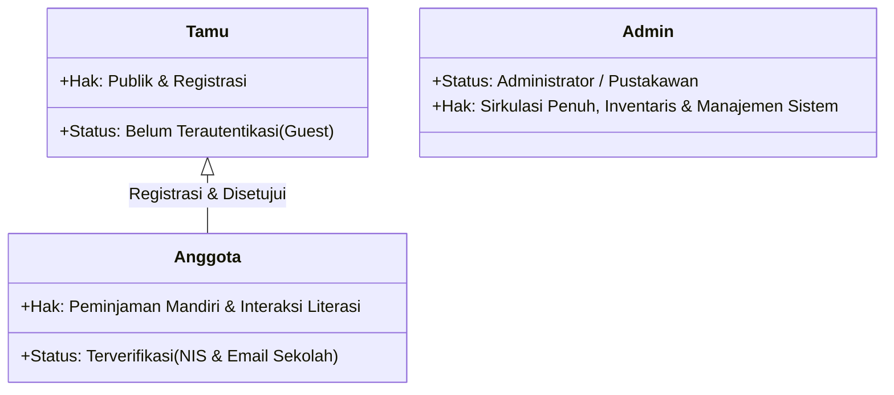

# Struktur & Spesifikasi Use Case Terperinci
## Sistem Informasi Perpustakaan Digital — AKSA NOVA (SMKN 1 Rongga)

> **Versi:** 2.2 | **Klasifikasi:** Dokumen Rekayasa Perangkat Lunak | **Standar:** UML 2.5 Use Case Standard

---

## 1. Definisi & Batasan 3 Aktor Sistem

Sistem AKSA NOVA membatasi interaksi hanya melalui **tiga aktor manusia**:



| Aktor | Peran Teknis (*Role*) | Ruang Lingkup Wewenang & Batasan (*Boundary*) |
|---|---|---|
| **Tamu** *(Guest)* | `guest` (tidak ada sesi login) | Mengakses beranda publik, mencari katalog buku, melihat informasi lokasi rak, melihat peta lokasi SMKN 1 Rongga, melihat banner promosi multimedia, dan melakukan registrasi akun baru. Tidak dapat meminjam atau memberi rating. |
| **Anggota** *(Siswa)* | `role: member` (`status: approved`) | Siswa resmi SMKN 1 Rongga dengan NIS valid. Dapat mengelola kartu anggota digital, mengajukan pinjaman buku online, melihat lokasi rak fisik buku, menyimpan buku favorit, memberi like, memberi rating 1–5, dan memantau status pinjaman/denda pribadi. |
| **Admin** *(Pustakawan)* | `role: admin` | Petugas pengelola perpustakaan dengan hak akses mutlak: CRUD buku fisik & rak, verifikasi pendaftaran akun, validasi pengajuan buku, pencatatan sirkulasi langsung, pengembalian buku, penagihan denda & pengingat WA, kelola banner multimedia, musik latar, serta ekspor laporan Excel. Dilarang memberi rating buku. |

---

## 2. Struktur Dekomposisi Paket Use Case (Package Breakdown)

Sistem dipecah ke dalam **6 Modul Bisnis Utama**:

```
AKSA_NOVA_SYSTEM
 ├── PKG-01: Modul Autentikasi & Akun Keanggotaan
 ├── PKG-02: Modul Katalog & Manajemen Rak Buku Fisik
 ├── PKG-03: Modul Sirkulasi & Pengajuan Peminjaman
 ├── PKG-04: Modul Pengembalian, Keterlambatan & Denda
 ├── PKG-05: Modul Interaksi & Keterlibatan Anggota
 └── PKG-06: Modul Pengaturan Sistem, Multimedia & Laporan
```

---

## 3. Matriks Hak Akses Aktor terhadap Use Case (Traceability Matrix)

Keterangan:
- **C** = Create (Membuat/Menambah)
- **R** = Read (Melihat/Membaca)
- **U** = Update (Mengubah/Memperbarui)
- **D** = Delete (Menghapus)
- **-** = Tidak memiliki akses

| ID | Nama Use Case | Paket Modul | Tamu | Anggota | Admin |
|---|---|---|:---:|:---:|:---:|
| **UC-01** | Registrasi Akun Anggota dengan NIS | PKG-01 | **C** | - | - |
| **UC-02** | Login Multi-Role | PKG-01 | **R** | **R** | **R** |
| **UC-03** | Logout Sistem | PKG-01 | - | **R** | **R** |
| **UC-04** | Kelola & Cetak Kartu Digital NIS | PKG-01 | - | **R, U** | **R** |
| **UC-05** | Lapor Lupa Kartu & Pembekuan (Freeze) | PKG-01 | - | **C, U** | **R, U** |
| **UC-06** | Verifikasi Pendaftaran Anggota | PKG-01 | - | - | **R, U** |
| **UC-07** | Kelola Profil & Keamanan Admin | PKG-01 | - | - | **R, U** |
| **UC-08** | Pencarian & Filter Katalog Buku | PKG-02 | **R** | **R** | **R** |
| **UC-09** | Melihat Detail & Lokasi Rak Fisik Buku | PKG-02 | **R** | **R** | **R** |
| **UC-10** | Pengambilan Data ISBN Otomatis | PKG-02 | - | - | **R** |
| **UC-11** | CRUD Data Buku, Stok & Lokasi Rak | PKG-02 | - | - | **C, R, U, D** |
| **UC-12** | Pengajuan Peminjaman Buku Online | PKG-03 | - | **C, R** | **R** |
| **UC-13** | Pemantauan Notifikasi Realtime Pengajuan | PKG-03 | - | - | **R** |
| **UC-14** | Verifikasi & Persetujuan/Penolakan Pengajuan | PKG-03 | - | - | **R, U** |
| **UC-15** | Input Peminjaman Langsung di Tempat | PKG-03 | - | - | **C, R** |
| **UC-16** | Proses Pengembalian Buku Fisik | PKG-04 | - | - | **R, U** |
| **UC-17** | Kalkulasi Denda Keterlambatan Otomatis | PKG-04 | - | **R** | **R, U** |
| **UC-18** | Pengiriman Pengingat WhatsApp Keterlambatan | PKG-04 | - | - | **C, R** |
| **UC-19** | Pelunasan & Validasi Pembayaran Denda | PKG-04 | - | - | **R, U** |
| **UC-20** | Simpan Buku Favorit (Bookmark) | PKG-05 | - | **C, R, D** | - |
| **UC-21** | Memberikan Tanda Suka (Like) Buku | PKG-05 | - | **C, D** | - |
| **UC-22** | Memberikan Ulasan Rating Bintang 1–5 | PKG-05 | - | **C, R, U** | *(Blocked)* |
| **UC-23** | Kelola Banner Multimedia (Gambar/GIF/Video) | PKG-06 | **R** | **R** | **C, R, U, D** |
| **UC-24** | Navigasi Peta Lokasi SMKN 1 Rongga | PKG-06 | **R** | **R** | **R, U** |
| **UC-25** | Pengaturan Musik Latar & Loop Otomatis | PKG-06 | **R** | **R** | **C, R, U** |
| **UC-26** | Kustomisasi Tema Tampilan (Dark/Light/Accent) | PKG-06 | - | **R, U** | **R, U** |
| **UC-27** | Konfigurasi Aturan Denda & Batas Waktu | PKG-06 | - | - | **R, U** |
| **UC-28** | Ekspor Laporan Excel Dashboard 3-Sheet | PKG-06 | - | - | **R** |

---

## 4. Diagram Use Case Lengkap (UML Diagram)

```mermaid
flowchart TB
    %% 3 Aktor Manusia
    Tamu([fa:fa-user Tamu / Guest])
    Anggota([fa:fa-user-graduate Anggota / Siswa])
    Admin([fa:fa-user-shield Admin / Pustakawan])

    subgraph SYSTEM_BOUNDARY["SISTEM INFORMASI PERPUSTAKAAN AKSA NOVA"]

        subgraph PKG01["PKG-01: Autentikasi & Akun"]
            UC01["UC-01: Registrasi Akun (NIS)"]
            UC02["UC-02: Login Multi-Role"]
            UC04["UC-04: Cetak Kartu Anggota Digital"]
            UC05["UC-05: Lapor Lupa Kartu & Freeze"]
            UC06["UC-06: Verifikasi Akun Siswa"]
            UC07["UC-07: Edit Profil & Sandi Admin"]
        end

        subgraph PKG02["PKG-02: Katalog & Rak Buku"]
            UC08["UC-08: Cari & Filter Buku"]
            UC09["UC-09: Cek Lokasi Rak Fisik Buku"]
            UC10["UC-10: Auto-Fetch ISBN"]
            UC11["UC-11: CRUD Buku, Stok & Lokasi Rak"]
        end

        subgraph PKG03["PKG-03: Sirkulasi Peminjaman"]
            UC12["UC-12: Ajukan Pinjam Online"]
            UC13["UC-13: Notifikasi Realtime Pop-up"]
            UC14["UC-14: Approval / Reject Pengajuan"]
            UC15["UC-15: Pinjam Langsung di Tempat"]
        end

        subgraph PKG04["PKG-04: Pengembalian & Denda"]
            UC16["UC-16: Pengembalian Buku Fisik"]
            UC17["UC-17: Hitung Denda Keterlambatan"]
            UC18["UC-18: Kirim Pengingat WhatsApp"]
            UC19["UC-19: Pelunasan Denda"]
        end

        subgraph PKG05["PKG-05: Interaksi Literasi"]
            UC20["UC-20: Simpan Buku Favorit"]
            UC21["UC-21: Beri Like Buku"]
            UC22["UC-22: Beri Rating Bintang (1-5)"]
        end

        subgraph PKG06["PKG-06: Konten, Pengaturan & Laporan"]
            UC23["UC-23: Banner Multimedia (GIF/Video/Img)"]
            UC24["UC-24: Peta Lokasi SMKN 1 Rongga"]
            UC25["UC-25: Musik Latar & Continuous Loop"]
            UC26["UC-26: Kustomisasi Tema & Font"]
            UC27["UC-27: Konfigurasi Tarif Denda"]
            UC28["UC-28: Ekspor Laporan Excel 3 Sheet"]
        end
    end

    %% Relasi Tamu
    Tamu --> UC01
    Tamu --> UC02
    Tamu --> UC08
    Tamu --> UC09
    Tamu --> UC24

    %% Relasi Anggota
    Anggota --> UC02
    Anggota --> UC04
    Anggota --> UC05
    Anggota --> UC08
    Anggota --> UC09
    Anggota --> UC12
    Anggota --> UC20
    Anggota --> UC21
    Anggota --> UC22
    Anggota --> UC26

    %% Relasi Admin
    Admin --> UC02
    Admin --> UC06
    Admin --> UC07
    Admin --> UC08
    Admin --> UC09
    Admin --> UC10
    Admin --> UC11
    Admin --> UC13
    Admin --> UC14
    Admin --> UC15
    Admin --> UC16
    Admin --> UC18
    Admin --> UC19
    Admin --> UC23
    Admin --> UC25
    Admin --> UC26
    Admin --> UC27
    Admin --> UC28

    %% Dependensi Antar Use Case (UML Include / Trigger)
    UC08 -.->|<<include>>| UC09
    UC12 -.->|<<trigger realtime>>| UC13
    UC16 -.->|<<include>>| UC17
    UC17 -.->|<<extend jika telat>>| UC18
    UC17 -.->|<<extend jika ada denda>>| UC19
    UC11 -.->|<<extend ISBN>>| UC10
```



---

## 5. Rincian Spesifikasi Use Case Berdasarkan Modul

### 5.1 PKG-01: Modul Autentikasi & Akun

#### UC-01: Registrasi Akun Anggota dengan NIS
* **Aktor Utama**: Tamu
* **Pre-kondisi**: Tamu membuka formulir registrasi (`sign_up.php`).
* **Alur Utama**:
  1. Tamu menginput: Nama Lengkap, **NIS**, Kelas, No. WhatsApp, Username, Email (`@student.smkn1rongga.sch.id`), Password, dan Foto Profil.
  2. Sistem memvalidasi keunikan NIS, username, dan format email sekolah.
  3. Sistem men-generate `no_anggota` otomatis berformat `AN-YYYYMM-XXXX`.
  4. Sistem menyimpan akun dengan status `pending` dan `role = 'member'`.
  5. Sistem menampilkan pesan sukses menunggu verifikasi pustakawan.
* **Alur Alternatif**:
  * *2a. Email bukan domain `@student.smkn1rongga.sch.id`*: Sistem menolak pendaftaran dan menampilkan peringatan validasi institusi.
  * *2b. NIS atau username sudah terdaftar*: Sistem memunculkan pesan bahwa data identitas telah digunakan.
* **Post-kondisi**: Record akun tersimpan dengan `status = 'pending'`.

#### UC-04: Kelola & Cetak Kartu Digital NIS
* **Aktor Utama**: Anggota
* **Pre-kondisi**: Anggota login dan akun berstatus `approved`.
* **Alur Utama**:
  1. Anggota membuka menu **Kartu Anggota** (`kartu_anggota.php`).
  2. Sistem merender kartu digital berdesain obsidian-gold dengan QR-Code, Barcode, No. Anggota, Nama, dan **NIS**.
  3. Anggota dapat mengklik **"Edit Kartu"** (`edit_kartu.php`) untuk memperbarui foto atau mengecek NIS.
  4. Anggota dapat menekan tombol **"Cetak / Unduh Kartu"** untuk mencetak fisik atau menyimpan PDF.
* **Post-kondisi**: Anggota memegang identitas resmi perpustakaan.

#### UC-05: Lapor Lupa Kartu & Pembekuan (Freeze)
* **Aktor Utama**: Anggota
* **Aktor Terkait**: Admin
* **Alur Utama**:
  1. Anggota melapor kehilangan/lupa kartu di `lupa_kartu.php`.
  2. Sistem mengubah status kartu menjadi `card_status = 'frozen'`.
  3. Selama status beku, akun tidak dapat digunakan untuk transaksi peminjaman baru demi mencegah penyalahgunaan.
  4. Admin dapat memverifikasi identitas fisik siswa di perpustakaan lalu mencairkan (*unfreeze*) status kartu.

---

### 5.2 PKG-02: Modul Inventaris & Rak Buku Fisik

#### UC-09: Melihat Detail & Lokasi Rak Fisik Buku
* **Aktor Utama**: Tamu, Anggota, Admin
* **Pre-kondisi**: Pengguna membuka halaman katalog atau kartu buku.
* **Alur Utama**:
  1. Pengguna mengklik cover atau tombol **"Detail"** pada buku yang diinginkan.
  2. Sistem memanggil `buku_detail.php?id={id}` via AJAX.
  3. Modal pop-up elegan tampil menyajikan:
     - Judul, pengarang, genre, ISBN, stok fisik.
     - **Chip Lokasi Rak Buku** (berwarna emas, misal: `📍 Rak A-1 (Sains)`).
     - Rata-rata rating bintang dan sinopsis buku.
  4. Pengguna mengetahui persis di mana buku tersebut disimpan di perpustakaan.
* **Post-kondisi**: Informasi letak buku tersampaikan dengan cepat dan akurat.

#### UC-11: CRUD Data Buku, Stok & Lokasi Rak
* **Aktor Utama**: Admin
* **Alur Utama**:
  1. Admin membuka `halaman_admin.php` dan menekan **"Tambah Buku"** atau **"Edit"**.
  2. Admin mengisi form: Judul, Pengarang, ISBN, Genre, Sinopsis, Stok Fisik, Gambar Cover, dan **Lokasi Rak Buku**.
  3. Admin menekan **"Simpan"**.
  4. Sistem memproses query `INSERT` atau `UPDATE` tabel `buku` termasuk kolom `rak`.
  5. Antarmuka terupdate seketika dengan badge lokasi rak di setiap buku.
* **Post-kondisi**: Katalog inventaris buku terbaharui secara fisik dan digital.

---

### 5.3 PKG-03: Modul Sirkulasi Peminjaman

#### UC-12: Pengajuan Peminjaman Buku Online
* **Aktor Utama**: Anggota
* **Pre-kondisi**: Anggota berstatus `approved` dan `card_status = 'active'`.
* **Alur Utama**:
  1. Anggota memilih buku di katalog yang memiliki stok > 0.
  2. Anggota membuka form pengajuan peminjaman (`pengajuan_peminjaman.php`).
  3. Sistem menampilkan info buku beserta **Lokasi Rak Buku** yang dipilih.
  4. Anggota menentukan batas tanggal kembali (maksimal sesuai pengaturan).
  5. Anggota memilih opsi waktu: **Ambil Sekarang** atau **Ambil Nanti** (dengan catatan jam).
  6. Anggota mengunggah bukti kartu anggota dan mengirim permohonan.
  7. Sistem mencatat ke tabel `pengajuan_peminjaman` dengan status `menunggu`.
* **Post-kondisi**: Tiket pengajuan terbentuk dan memicu notifikasi realtime admin.

#### UC-13 & UC-14: Notifikasi Realtime Pop-up & Approval Pengajuan
* **Aktor Utama**: Admin
* **Aktor Terkait**: Anggota
* **Alur Utama**:
  1. Polling latar belakang (interval 4 detik) mendeteksi adanya tiket berstatus `menunggu`.
  2. Sistem membunyikan lonceng harmonik (*Web Audio chime*) dan memunculkan **Modal Pop-up Besar** di depan layar admin di halaman mana pun admin berada.
  3. Modal menampilkan nama siswa, cover buku, waktu pengambilan, serta **Lokasi Rak Buku**.
  4. Admin menekan tombol **"Buka & Proses Pengajuan"** menuju `pengajuan_buku.php`.
  5. Admin memeriksa ketersediaan fisik di rak dan memilih:
     - **Setujui**: Sistem secara atomic memotong stok (`stok = stok - total_buku`), memasukkan data ke tabel `peminjaman` status `dipinjam`, dan menandai tiket `disetujui`.
     - **Tolak**: Admin memasukkan alasan penolakan (misal: "Buku rusak / sedang dipreservasi"), status tiket berubah `ditolak`, dan stok tidak terpotong.
* **Post-kondisi**: Status sirkulasi tervalidasi dan stok buku terjamin konsisten.

---

### 5.4 PKG-04: Modul Pengembalian & Denda

#### UC-16, UC-17, UC-18, UC-19: Alur Pengembalian & Denda
* **Aktor Utama**: Admin
* **Aktor Terkait**: Anggota
* **Alur Utama**:
  1. Siswa mengembalikan buku fisik ke meja perpustakaan.
  2. Admin membuka `telah_dipinjam.php` dan mengklik **"Kembalikan Buku"**.
  3. Sistem mengembalikan stok fisik (`stok = stok + 1`) dan mengisi `waktu_kembali`.
  4. **Kalkulasi Denda Otomatis (UC-17)**:
     - Jika `waktu_kembali <= batas_kembali`: denda = 0, status denda `tidak_ada`.
     - Jika `waktu_kembali > batas_kembali`: sistem menghitung selisih hari keterlambatan dikalikan tarif denda harian (tabel `pengaturan`), menetapkan status denda `belum_bayar`.
  5. **Pengingat WhatsApp (UC-18)**: Jika anggota menunggak pengembalian, admin dapat menekan tombol kirim WhatsApp yang membuka tautan pesan pengingat resmi dan tercatat di `reminder_log`.
  6. **Pelunasan Denda (UC-19)**: Setelah siswa membayar denda keterlambatan, admin mengonfirmasi pembayaran dan status denda berubah menjadi `lunas`.

---

### 5.5 PKG-05: Modul Interaksi Literasi

#### UC-22: Pemberian Rating Bintang (1–5)
* **Aktor Utama**: Anggota
* **Aturan Bisnis Khusus**:
  * Aktor **Admin diblokir** dari memberikan rating untuk menjaga objektivitas murni pembaca.
  * Anggota hanya dapat memberikan 1 rating per buku (`UNIQUE KEY user_id, buku_id`), tetapi dapat memperbaruinya sewaktu-waktu.
* **Alur Utama**:
  1. Anggota membuka modal detail buku.
  2. Anggota memilih bintang 1 hingga 5.
  3. Sistem memproses via AJAX ke `rating_handler.php`.
  4. Sistem menyimpan ke `buku_ratings` dan menghitung ulang nilai rata-rata (*rating average*) buku.
  5. UI memperbarui bintang terisi dan memunculkan notifikasi konfirmasi.

---

### 5.6 PKG-06: Modul Konten, Pengaturan & Laporan

#### UC-23: Kelola Banner Multimedia (Gambar, GIF, Video)
* **Aktor Utama**: Admin
* **Alur Utama**:
  1. Admin membuka `kelola_banner.php`.
  2. Admin memilih berkas media promosi:
     - **JPG / PNG / WEBP**: diarahkan ke canvas cropper 16:7.
     - **GIF Animasi**: mem-bypass crop sehingga animasi tidak membeku.
     - **Video MP4 / WEBM (maks 50MB)**: mem-bypass crop, menyajikan preview pemutar video.
  3. Admin menentukan judul, subjudul, link klik, dan urutan slide.
  4. Banner tersimpan dan tayang di hero beranda (`index.php`) secara otomatis (`` untuk GIF, `<video autoplay muted loop playsinline>` untuk video).

#### UC-24: Navigasi Peta Lokasi SMKN 1 Rongga
* **Aktor Utama**: Tamu, Anggota, Admin
* **Alur Utama**:
  1. Pengguna membuka beranda.
  2. Pengguna melihat section peta Google Maps embed yang presisi mengarah ke **SMK Negeri 1 Rongga**, Jl. Situ Gede / Jl. Raya Rongga, Desa Cibedug, Kec. Rongga, Kab. Bandung Barat 40565.
  3. Admin dapat menyesuaikan detail query peta sewaktu-waktu via tabel `pengaturan`.

#### UC-25: Pengaturan Musik Latar & Continuous Loop
* **Aktor Utama**: Admin
* **Alur Utama**:
  1. Admin mengunggah berkas audio dan memilih lagu aktif di `pengaturan_musik.php`.
  2. Sistem memutar musik secara persisten di seluruh halaman melalui `settings_include.php`.
  3. Ketika durasi musik berakhir, event listener otomatis me-replay audio dari detik 0:00 (**auto-loop**) tanpa henti.

#### UC-28: Ekspor Laporan Excel Dashboard 3-Sheet
* **Aktor Utama**: Admin
* **Alur Utama**:
  1. Admin membuka dasbor statistik `dashboard.php`.
  2. Admin mengklik tombol **"Export Excel"**.
  3. Script `export_excel_dashboard.php` menyusun file SpreadsheetML XML (.xls):
     - **Sheet 1 — Rekap Bulanan**: Tren peminjaman setiap bulan.
     - **Sheet 2 — Ringkasan Perpustakaan**: Total buku, anggota terdaftar, pinjaman aktif, status denda.
     - **Sheet 3 — Buku Terpopuler**: 20 buku paling banyak diminati siswa.
  4. File terunduh otomatis untuk keperluan arsip dan pelaporan pimpinan sekolah.

---

## 6. Aturan Bisnis & Integritas Sistem (Business Rules)

1. **BR-01 (Integritas Stok Fisik)**:
   Pengurangan stok buku wajib bersifat atomic (`stok = stok - total_buku WHERE stok >= total_buku`). Pembatalan/penolakan pinjam tidak mengurangi stok, sedangkan pengembalian buku menambah stok kembali secara otomatis.
2. **BR-02 (Pembekuan Kartu Lupa/Hilang)**:
   Anggota dengan status `card_status = 'frozen'` secara otomatis dicegah melakukan pengajuan peminjaman baru sampai diverifikasi oleh pustakawan.
3. **BR-03 (Objektivitas Rating)**:
   Akun dengan peran `admin` tidak diperbolehkan memberikan rating atau ulasan pada buku.
4. **BR-04 (Domain Email Sekolah)**:
   Pendaftaran anggota baru wajib menggunakan alamat surel sekolah dengan domain resmi `@student.smkn1rongga.sch.id` serta mencantumkan NIS valid.
5. **BR-05 (Konsistensi Penunjuk Rak)**:
   Informasi kolom `rak` dari tabel `buku` harus selalu diikutsertakan pada semua modal detail buku, antarmuka pemilihan buku saat meminjam, dan notifikasi popup peminjaman admin.
