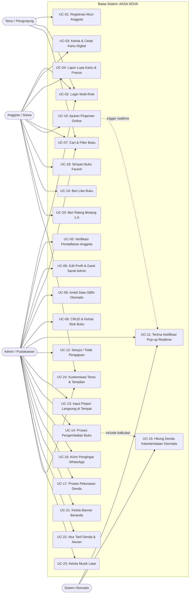

# Dokumen Use Case (Use Case Specification & Diagram)
## Sistem Informasi Perpustakaan Digital — AKSA NOVA

Dokumen ini merinci aktor, diagram use case, pemetaan use case per modul bisnis, serta skenario alur (use case specification) lengkap untuk sistem **AKSA NOVA** berdasarkan pembaruan sistem terkini.

---

## 1. Identifikasi Aktor (Actors)

| Aktor | Tipe | Deskripsi Peran |
|---|---|---|
| **Admin / Pustakawan** | Primary Actor (Internal) | Pengelola sistem perpustakaan yang memiliki wewenang penuh atas sirkulasi buku, persetujuan anggota, inventaris buku, verifikasi pengajuan, pelunasan denda, serta konfigurasi sistem. |
| **Anggota / Member** | Primary Actor (Internal) | Siswa atau guru yang terdaftar secara resmi. Memiliki akses untuk mencari buku, mengajukan peminjaman online, mencetak kartu digital, menyimpan buku favorit, memberi like, serta memberikan rating ulasan. |
| **Pengunjung / Tamu** | Secondary Actor (Eksternal) | Pengguna publik yang belum memiliki akun/belum login. Dapat melihat katalog umum dan diarahkan mendaftar/login untuk melakukan peminjaman. |
| **Sistem (Background Engine)** | Automated Actor | Komponen latar belakang yang menjalankan polling realtime pengajuan baru, penghitungan denda keterlambatan otomatis, pemutaran audio berkelanjutan (*AksaAudio*), dan logging pengingat. |

---

## 2. Diagram Use Case (Mermaid Diagram)

---

## 3. Matriks Daftar Use Case (Use Case Matrix)

| ID | Nama Use Case | Aktor Utama | Aktor Terkait | Deskripsi Singkat |
|---|---|---|---|---|
| **UC-01** | Registrasi Akun Anggota | Tamu | Sistem | Mengisi form identitas (NIK, Kelas, WhatsApp, Foto) untuk mendapatkan akun berstatus `pending`. |
| **UC-02** | Login Multi-Role | Semua Aktor | Sistem | Memasukkan username/email dan sandi untuk diarahkan ke dasbor sesuai peran (`admin` / `member`). |
| **UC-03** | Kelola & Cetak Kartu Digital | Anggota | - | Melihat kartu digital, mengedit detail tertentu, dan mengunduh/mencetak kartu anggota resmi. |
| **UC-04** | Lapor Lupa Kartu & Freeze | Anggota | Admin | Melaporkan kartu hilang/terlupa, membekukan kartu sementara (`frozen`), dan verifikasi pertanyaan. |
| **UC-05** | Verifikasi Pendaftaran Anggota | Admin | Sistem | Meninjau dan menyetujui (*approve*) atau menolak (*reject*) pendaftaran calon anggota baru. |
| **UC-06** | Edit Profil & Ganti Sandi Admin | Admin | Sistem | Mengubah nama tampilan (*display name*), foto avatar, dan kata sandi admin secara aman via modal universal. |
| **UC-07** | Cari & Filter Buku | Semua Aktor | - | Melakukan pencarian live (*instant search*) berdasarkan judul/penulis dan menyaring genre buku. |
| **UC-08** | Ambil Data ISBN Otomatis | Admin | Google Books/Open Library | Mengetikkan nomor ISBN untuk auto-fill metadata dan gambar cover buku dari server pustaka global. |
| **UC-09** | CRUD & Kelola Stok Buku | Admin | - | Menambah buku baru, mengedit informasi, menghapus buku, dan memperbarui jumlah stok fisik di rak. |
| **UC-10** | Ajukan Pinjaman Buku Online | Anggota | Sistem | Memilih buku, batas tanggal kembali, opsi *Ambil Sekarang* / *Nanti*, dan unggah berkas kartu anggota. |
| **UC-11** | Notifikasi Pop-up Realtime Pengajuan | Admin | Sistem | Menerima pop-up modal besar seketika di halaman admin mana pun dengan nada lonceng saat ada pengajuan baru. |
| **UC-12** | Setujui / Tolak Pengajuan | Admin | Anggota, Sistem | Memvalidasi pengajuan pinjaman; jika disetujui stok berkurang atomic; jika ditolak diberi catatan alasan. |
| **UC-13** | Input Pinjam Langsung di Tempat | Admin | Anggota | Membuat transaksi peminjaman langsung di meja perpustakaan untuk anggota yang datang langsung. |
| **UC-14** | Proses Pengembalian Buku | Admin | Anggota, Sistem | Mencatat fisik buku yang dikembalikan, menambah stok buku, dan mendeteksi keterlambatan. |
| **UC-15** | Hitung Denda Otomatis | Sistem | Admin | Menghitung hari terlambat dan nominal denda secara presisi saat pengembalian diproses. |
| **UC-16** | Kirim Pengingat WhatsApp | Admin | Anggota, Sistem | Membuka link pengingat WhatsApp otomatis ke nomor peminjam yang jatuh tempo dan mencatatnya ke `reminder_log`. |
| **UC-17** | Proses Pelunasan Denda | Admin | Anggota | Mengonfirmasi pembayaran denda anggota dan mengubah status denda menjadi `lunas`. |
| **UC-18** | Simpan Buku Favorit | Anggota | - | Memasukkan buku ke daftar simpanan (*bookmarks*) untuk dibaca/dipinjam di lain waktu. |
| **UC-19** | Beri Like Buku | Anggota | - | Memberikan apresiasi suka (*like*) pada buku yang disukai. |
| **UC-20** | Beri Rating Bintang (1–5) | Anggota | - | Memberikan ulasan bintang 1 sampai 5. *(Role admin diblokir dari aksi ini demi objektivitas)*. |
| **UC-21** | Kelola Banner Beranda | Admin | - | Menambah, mengedit, mengaktifkan/menonaktifkan gambar promosi carousel pada beranda. |
| **UC-22** | Atur Tarif Denda & Kebijakan | Admin | - | Mengubah konfigurasi nominal denda per hari dan maksimal hari pinjam di tabel `pengaturan`. |
| **UC-23** | Kelola Musik Latar | Admin | Sistem | Mengunggah file musik, memilih lagu aktif, dan mengatur audio persisten perpustakaan. |
| **UC-24** | Kustomisasi Tema & Tampilan | Semua Aktor | Sistem | Mengatur mode gelap/terang, palet aksen warna, jenis huruf (*Outfit, Nunito, Poppins*), dan tata letak. |

---

## 4. Rincian Spesifikasi Use Case Kunci (Use Case Specifications)

### 4.1 UC-10: Ajukan Pinjaman Buku Online
- **Aktor**: Anggota (`member`)
- **Pre-kondisi**: Anggota telah login, berstatus `approved`, dan status kartu `active`. Buku yang dipilih memiliki stok > 0.
- **Alur Utama (Main Flow)**:
  1. Anggota membuka halaman katalog atau detail buku.
  2. Anggota menekan tombol **"Ajukan Pinjam"**.
  3. Sistem mengarahkan ke formulir pengajuan peminjaman (`pengajuan_peminjaman.php`).
  4. Anggota memilih batas waktu pengembalian (maksimal 7–14 hari).
  5. Anggota memilih opsi waktu pengambilan:
     - **Ambil Sekarang**: Segera mengambil di meja pustakawan.
     - **Ambil Nanti**: Mengisi catatan waktu spesifik pengambilan (misal: "Istirahat jam 12.00").
  6. Anggota mengunggah bukti foto kartu anggota.
  7. Anggota menekan tombol **"Kirim Pengajuan Peminjaman"**.
  8. Sistem memvalidasi input, menyimpan berkas foto ke server, dan menyimpan record ke tabel `pengajuan_peminjaman` dengan status `menunggu`.
  9. Sistem menampilkan pesan sukses dan mengarahkan ke dashboard pengguna.
- **Alur Alternatif (Alternative Flow)**:
  - *4a. Akun berstatus dibekukan (`frozen`)*: Sistem menolak pengajuan dan menampilkan peringatan bahwa akun sedang dalam investigasi Lupa Kartu.
  - *8a. Berkas gagal diunggah / ukuran melebihi batas*: Sistem menampilkan notifikasi galat dan meminta anggota mengunggah ulang file yang valid.
- **Post-kondisi**: Tiket pengajuan berstatus `menunggu` terbentuk di basis data dan siap memicu notifikasi admin.

---

### 4.2 UC-11: Penerimaan Notifikasi Pop-up Realtime Pengajuan (Admin)
- **Aktor**: Admin / Pustakawan
- **Aktor Pendukung**: Sistem Otomatis
- **Pre-kondisi**: Admin sedang aktif membuka salah satu halaman admin perpustakaan.
- **Alur Utama (Main Flow)**:
  1. Sistem di latar belakang melakukan polling ke `api_cek_pengajuan_admin.php` setiap 4 detik.
  2. Sistem mendeteksi adanya pengajuan baru berstatus `menunggu` yang belum dilihat oleh admin.
  3. Sistem memutar nada lonceng (*Web Audio Chime*) 4-harmonik secara otomatis.
  4. Sistem menampilkan **Modal Pop-up Besar** di depan layar admin dengan animasi glowing border:
     - Menampilkan judul buku, cover, nama peminjam, kelas, jumlah eksemplar, batas waktu, dan opsi pengambilan.
     - Memperbarui angka badge pada menu sidebar "Pengajuan Buku".
  5. Admin meninjau notifikasi tersebut.
  6. Admin memilih tindakan:
     - **Klik Tombol "Buka & Proses Pengajuan"**: Sistem langsung mengarahkan browser ke `pengajuan_buku.php` (atau me-refresh daftar jika sudah berada di halaman tersebut).
     - **Klik Tombol "Nanti Saja" / Tutup (X) / Tekan ESC**: Modal tertutup dan sistem mengingat ID pengajuan agar tidak mengganggu admin berulang kali.
- **Alur Alternatif (Alternative Flow)**:
  - *4a. Pengajuan telah disetujui/ditolak oleh admin lain di tab lain*: Sistem mendeteksi `count_menunggu == 0` dan otomatis menutup modal secara cerdas.
- **Post-kondisi**: Admin mengetahui adanya pengajuan pinjaman baru secara langsung tanpa perlu melakukan refresh halaman manual.

---

### 4.3 UC-12: Persetujuan / Penolakan Pengajuan Pinjaman
- **Aktor**: Admin / Pustakawan
- **Pre-kondisi**: Admin berada di halaman `pengajuan_buku.php` dan terdapat pengajuan berstatus `menunggu`.
- **Alur Utama (Persetujuan)**:
  1. Admin memeriksa data peminjam dan mengecek ketersediaan stok fisik buku.
  2. Admin menekan tombol **"Setujui"**.
  3. Sistem memeriksa stok buku secara atomic (`stok >= total_buku`).
  4. Sistem mengurangi stok buku (`stok = stok - total_buku`).
  5. Sistem menyalin transaksi ke tabel `peminjaman` dengan status `dipinjam`.
  6. Sistem mengubah status tiket `pengajuan_peminjaman` menjadi `disetujui` dan mencatat `approved_at`.
  7. Sistem memperbarui antarmuka tabel dan badge sidebar.
- **Alur Alternatif (Penolakan)**:
  - *2a. Admin memilih tolak*: Admin mengklik tombol **"Tolak"** dan mengisi modal alasan penolakan (misal: "Stok habis" atau "Kartu anggota buram").
  - *2b. Konfirmasi penolakan*: Sistem mengupdate status menjadi `ditolak` dan menyimpan `alasan_penolakan`. Stok buku tidak berkurang.
- **Post-kondisi**: Transaksi peminjaman resmi tercatat aktif jika disetujui, atau siswa menerima alasan penolakan di dasbor mereka jika ditolak.

---

### 4.4 UC-14 & UC-15: Pengembalian Buku & Perhitungan Denda
- **Aktor**: Admin / Pustakawan
- **Pre-kondisi**: Transaksi peminjaman berstatus `dipinjam`.
- **Alur Utama**:
  1. Admin membuka halaman `telah_dipinjam.php`.
  2. Admin mencari transaksi siswa berdasarkan nama atau judul buku.
  3. Admin mengklik tombol aksi **"Kembalikan Buku"**.
  4. Sistem membandingkan `waktu_sekarang` dengan `batas_kembali`:
     - **Tepat Waktu**: `terlambat_hari = 0`, `denda = 0`, `status_denda = 'tidak_ada'`.
     - **Terlambat**: Sistem menghitung selisih hari (`terlambat_hari > 0`), mengalikan dengan tarif denda harian (misal: Rp 1.000/hari), dan menetapkan `status_denda = 'belum_bayar'`.
  5. Sistem menambah kembali stok fisik buku (`stok = stok + 1`).
  6. Sistem mengupdate status transaksi menjadi `dikembalikan` dan mengisi `waktu_kembali`.
  7. Jika ada denda, sistem menampilkan jumlah denda yang wajib diselesaikan siswa.
- **Post-kondisi**: Buku kembali tersedia di rak inventaris dan kewajiban denda tercatat akurat.

---

### 4.5 UC-20: Pemberian Rating Bintang Buku (1–5)
- **Aktor**: Anggota (`member`)
- **Pre-kondisi**: Pengguna telah login dengan peran `member`.
- **Alur Utama**:
  1. Anggota membuka halaman detail buku (`buku_detail.php` atau modal detail di katalog).
  2. Anggota memilih rating bintang (1 hingga 5 bintang).
  3. Sistem mengirim request ke `rating_handler.php` secara asinkron (AJAX).
  4. Sistem memverifikasi peran pengguna:
     - Jika pengguna adalah `member`: sistem menyimpan/memperbarui data ke tabel `buku_ratings` (`ON DUPLICATE KEY UPDATE`).
     - Sistem menghitung ulang rata-rata rating buku.
  5. Sistem mengembalikan response sukses beserta nilai rata-rata rating baru dan memunculkan toast konfirmasi.
- **Alur Pengecualian (Role Admin Diblokir)**:
  - *4a. Pengguna memiliki `role === 'admin'`*: Sistem memblokir aksi dan mengembalikan pesan bahwa admin dilarang memberi rating demi menjaga objektivitas ulasan pembaca.
- **Post-kondisi**: Rating buku terbarui di basis data secara adil dan terpercaya.
